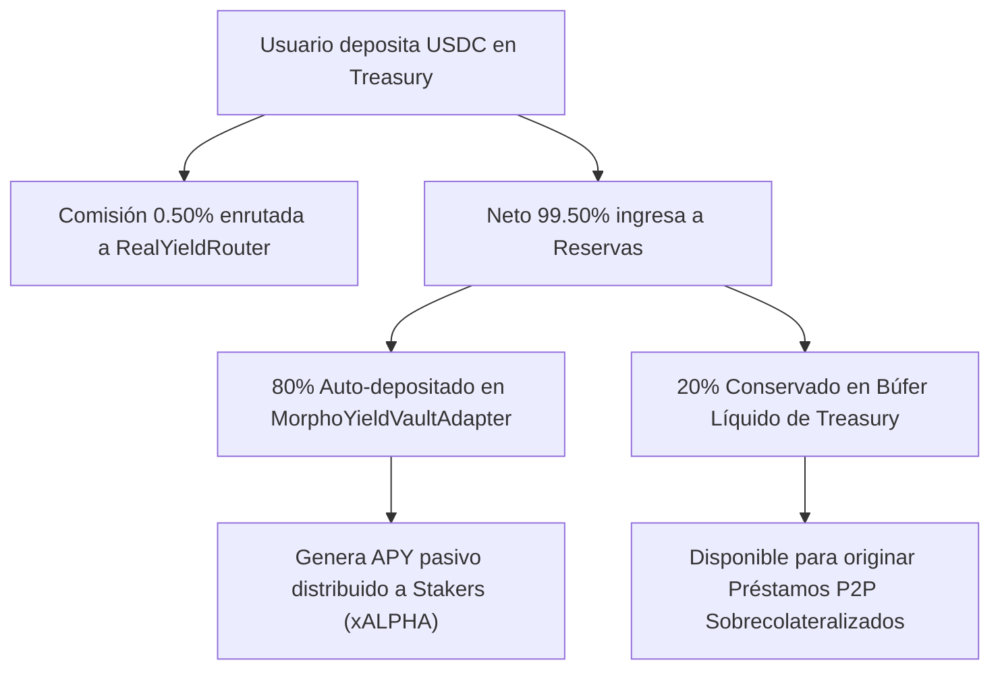

# 📜 BIBLIA DE TOKENOMICS - ALPHA CENTAURI PROTOCOL

## 🌟 Visión General y Filosofía de Real Yield

El Protocolo **Alpha Centauri** opera bajo un modelo estricto de **Real Yield Respaldado por Activos** y **Proof of Reserves (PoR) en Tiempo Real**. Todos los tokens `ALPHA` emitidos cuentan con respaldo patrimonial verificable on-chain con un ratio de solvencia garantizado **$\ge 100.00\%$**.

---

## 🏛️ 1. Reparto Universal de Comisiones (Modelo 50 / 25 / 25)

Toda comisión generada por cualquier operativa de la plataforma (depósitos, rescates, compra de bonos vestados, penalizaciones por ragequit, originación e intereses de préstamos P2P) ingresa a través del contrato `RealYieldRouter.sol` y se distribuye estrictamente bajo la siguiente regla universal:

| Porcentaje | Destino | Mecanismo On-Chain | Propósito Económico |
| :--- | :--- | :--- | :--- |
| **50%** | **Reservas Estratégicas** (`Treasury.sol`) | Depósito directo en Tesorería | Incrementa el NAV por token y fortalece las reservas respaldadas por activos |
| **25%** | **Corporate OpEx Vault** (`CorporateOpExVault.sol`) | Auto-Swap en DEX a `ALPHA` y Staking | Financia gastos operativos acumulando tokens ALPHA reales comprados en mercado |
| **25%** | **Corporate Profit Vault** (`CorporateProfitVault.sol`) | Auto-Swap en DEX a `ALPHA` y Staking | Acumula beneficios corporativos exclusivamente en tokens ALPHA reales comprados en mercado |

> [!IMPORTANT]
> **PROHIBICIÓN DE MINTEADO SIN RESPALDO**: Las carteras corporativas (`OpEx` y `Profit`) **NUNCA** reciben tokens ALPHA minteados de la nada. Toda asignación a las bóvedas corporativas proviene exclusivamente de swaps de mercado DEX con comisiones reales capturadas.

---

## 🏦 2. Sub-Reserva 80 / 20 de USDC en Tesorería

Para optimizar el rendimiento del capital inactivo de la Tesorería sin comprometer la liquidez operativa, todo depósito en USDC que ingresa a `Treasury.sol` se divide de forma automática:



- **80% (Sub-Reserva de Rendimiento)**: Transferido automáticamente a `MorphoYieldVaultAdapter.sol` para generar rendimiento pasivo en Morpho Vaults.
- **20% (Búfer de Liquidez P2P)**: Conservado de forma líquida en `Treasury.sol` para financiar préstamos P2P sobrecolateralizados solicitados por los usuarios (`P2PLendingMarket.sol`).

---

## 🔒 3. Bóvedas Corporativas Exclusivas en Token ALPHA

Las carteras corporativas de OpEx y Beneficios no acumulan stablecoins ni activos heterogéneos:

1. **Moneda Única (`ALPHA`)**: Si una comisión ingresa en USDC, USDT u otro token, el `RealYieldRouter` efectúa una compra en mercado (DEX) del token `ALPHA`.
2. **Auto-Staking**: El token `ALPHA` resultante se deposita inmediatamente en `GovernanceStaking.sol` asignado a las bóvedas segregadas `CorporateOpExVault` y `CorporateProfitVault`.

---

## 📊 4. Matriz Completa de Comisiones y Descuentos

| Operativa | Contrato Responsable | Comisión / Penalización | Enrutamiento On-Chain |
| :--- | :--- | :--- | :--- |
| **Treasury Deposit** | `Treasury.sol` | **0.50%** | Enrutado vía `RealYieldRouter` (50/25/25) |
| **Treasury Redeem** | `Treasury.sol` | **1.00%** | Enrutado vía `RealYieldRouter` (50/25/25) |
| **Vested Bond Mint** | `VestedDiscountVault.sol` | **1.50%** | Enrutado vía `RealYieldRouter` (50/25/25) |
| **Vested Bond Ragequit** | `VestedDiscountVault.sol` | **15.00%** (Penalización) | **100%** de la penalización enrutado vía `RealYieldRouter` (50/25/25). El 85% restante se reembolsa al usuario |
| **P2P Loan Origination** | `P2PLendingMarket.sol` | **0.50%** | Enrutado vía `RealYieldRouter` (50/25/25) |
| **P2P Interest Spread** | `P2PLendingMarket.sol` | **10.00%** del Interés | Enrutado vía `RealYieldRouter` (50/25/25) |
| **Staking Entry Fee** | `GovernanceStaking.sol` | **1.00%** | Distribuido a stakers / reservas |

---

## 🎯 5. Tabla de Vested Discount Vault (Escala de Maduración)

Los bonos con descuento se mintean como **NFTs de Posición** (`VaultPositionNFT.sol`) y otorgan descuentos crecientes según la duración del bloqueo:

| Periodo de Vesting | Descuento Aplicado | Penalización por Cancelación (`Ragequit`) |
| :---: | :---: | :---: |
| **3 Meses** | **5.00%** | **15.00%** |
| **6 Meses** | **10.00%** | **15.00%** |
| **12 Meses** | **15.00%** | **15.00%** |
| **24 Meses** | **20.00%** | **15.00%** |
| **36 Meses** | **25.00%** | **15.00%** |

---

## 🛡️ 6. Proof of Reserves (PoR) e Invariante de Solvencia

El contrato `Treasury.sol` calcula en todo momento la solvencia del protocolo combinando los activos custodiados con las obligaciones vigentes:

$$\text{Activos Totales USD} = \text{NAV Treasury} + \text{USDC en Morpho} + \text{USDC en Préstamos P2P} + \text{Cuentas por Cobrar P2P} + \text{Staking Rewards}$$

$$\text{Pasivos Totales USD} = \text{Oferta Total de Shares ALPHA} + \text{Obligaciones NPV de Vested Vault}$$

$$\text{Ratio de Solvencia} = \left( \frac{\text{Activos Totales USD}}{\text{Pasivos Totales USD}} \right) \times 100 \ge 100.00\%$$

---

## 🔍 7. Verificación de Inspección Interna On-Chain

La validez de esta especificación se audita dinámicamente mediante el script de inspección directa de balances [frontend/test_strict_tokenomics_audit.cjs](file:///C:/Users/Admin/Desktop/token/frontend/test_strict_tokenomics_audit.cjs):

```bash
node frontend/test_strict_tokenomics_audit.cjs
```
