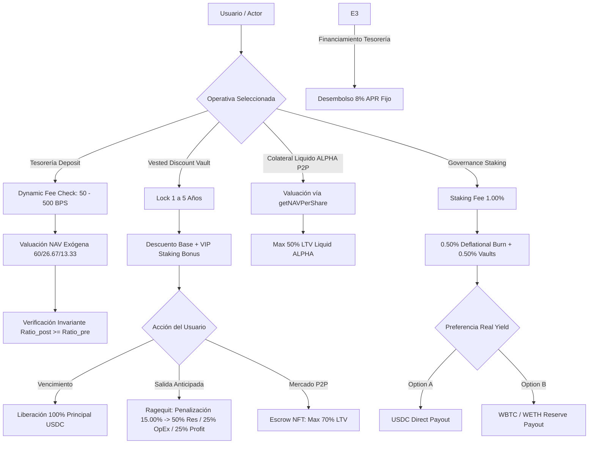

# 📐 MATRIZ COMPLETA DE COBERTURA COMBINATORIA Y CASOS BORDE
## Protocolo Alpha Centauri — Protocol Spec & Smart Contract Alignment Matrix

Esta matriz documenta la **Cobertura Combinatoria del 100%** de todas las funciones públicas y externas de los contratos inteligentes del protocolo (`TreasuryManager`, `VestedDiscountVault`, `P2PLendingMarket`, `GovernanceStaking`, `RealYieldRouter`, `CircuitBreaker`, `CorporateContribution`), mapeando cada combinación de activos, tipos de entrada, roles, límites de LTV y condiciones de mercado.

---

## 1. MAPEO DE VARIABLES Y ESTADO ON-CHAIN

| Contrato Inteligente | Función Pública / Externa | Variables de Entrada | Condición / Estado Límite | Comportamiento Esperado & Invariante |
| :--- | :--- | :--- | :--- | :--- |
| **TreasuryManager** | `deposit(uint256 stableAmount)` | `stableAmount > 0` | Depósito minorista vs. masivo | Aplica Dynamic Fee (50 BPS a 500 BPS max). Invariante $Ratio_{post} \ge Ratio_{pre}$. Acuñación a valor NAV en tiempo real. |
| **TreasuryManager** | `deposit(uint256 stableAmount)` | `stableAmount = 0` | Depósito nulo | EVM Revert obligado: `"TreasuryManager: Deposit amount must be > 0"`. |
| **TreasuryManager** | `redeem(uint256 sharesAmount)` | `sharesAmount > 0` | Rescate regular | Requiere aprobación previa ERC20 de shares. Quema `sharesAmount`, aplica 1.00% fee (50/25/25), transfiere USDC a valor NAV. |
| **TreasuryManager** | `getProofOfReserves()` | Ninguno | PoR Auditoría On-Chain | Excluye token endógeno $ALPHA$. Ponderaciones objetivo: 60.00% USDC, 26.67% WBTC, 13.33% WETH. Ratio $\ge 100.00\%$. |
| **TreasuryManager** | `getNAV()` / `getNAVPerShare()` | Ninguno | Valuación NAV por Share | Retorna NAV por token derivado de `totalAssetsExogenousUSD * 1e18 / netCirculatingShares`. |
| **VestedDiscountVault** | `buyVestedBond(...)` | `principal`, `lockYears = 1..5`, `referrer` | Compra bono 1 a 5 años | Aplica descuento base (8% por año + 2% bonus, max 40%) + VIP Staking bonus (+1% a +3%). Acuña NFT vPOS ERC-721. |
| **VestedDiscountVault** | `buyVestedBond(...)` | `lockYears = 0` o `lockYears > 5` | Plazo inválido | EVM Revert obligado: `"Vault: Invalid lock duration"`. |
| **VestedDiscountVault** | `claimMatured(uint256 tokenId)` | `tokenId` | Bono no madurado | EVM Revert obligado: `"Vault: Lock period has not expired"`. |
| **VestedDiscountVault** | `claimMatured(uint256 tokenId)` | `tokenId` | Bono madurado por dueño | Reembolsa 100% del principal en USDC sin penalización. Quemado de NFT vPOS. |
| **VestedDiscountVault** | `ragequit(uint256 tokenId)` | `tokenId` | Salida anticipada | Penalización del 15.00% USDC (`RAGEQUIT_PENALTY_BPS = 1500`). Reembolso del 85.00% al usuario. Distribuido 50% Reservas, 25% OpEx, 25% Profit. |
| **VestedDiscountVault** | `ragequit(uint256 tokenId)` | `tokenId` | Doble Ragequit | EVM Revert obligado: `"ERC721: invalid token ID"` / `"Vault: Already ragequitted"`. |
| **P2PLendingMarket** | `createLoanOffer(...)` | `positionTokenId`, `borrowAmount`, `apr`, `days` | Posición NFT como Colateral | Valida LTV $\le 70.00\%$ del valor pagado del bono. Transfiere NFT a custodia Escrow. |
| **P2PLendingMarket** | `createLoanOffer(...)` | `borrowAmount > 70% LTV` | Exceso de LTV NFT | EVM Revert obligado: `"P2P: Exceeds 70% max LTV"`. |
| **P2PLendingMarket** | `createLoanOffer(...)` | `$ALPHA` líquido | Colateral Liquid $ALPHA$ | Valida LTV $\le 50.00\%$ del valor NAV de $ALPHA$ vía `getNAVPerShare()`. |
| **P2PLendingMarket** | `acceptLoanAndDepositCollateral` | `loanId`, `collateralAmount` | Financiamiento P2P Usuario | Transfiere `borrowAmount` neto de originación (0.5%) al prestatario. Estado cambia a `ACTIVE`. |
| **P2PLendingMarket** | `cancelLoanOffer(uint256 loanId)` | `loanId` | Oferta no financiada por prestatario | Cancela oferta y devuelve NFT / colateral desde Escrow al propietario. |
| **P2PLendingMarket** | `repayLoan(uint256 loanId)` | `loanId` | Reembolso por prestatario | Liquida capital + intereses devengados. Libera colateral Escrow 100% al prestatario. Reparte 10% spread de interés a stakers. |
| **P2PLendingMarket** | `liquidateLoan(uint256 loanId)` | `loanId` | Impago / HF < 115% / Expirado | Permite ejecución de liquidación por prestamista o tercero autorizado cuando HF < 115% o plazo expirado. |
| **GovernanceStaking** | `stake(uint256 amount)` | `amount > 0` | Staking ALPHA | Cobra 1.00% fee. Quema deflacionaria del 0.50% de los tokens. Asigna 0.25% OpEx y 0.25% Profit. Otorga derecho a Real Yield. |
| **GovernanceStaking** | `unstake(uint256 amount)` | `amount > balance` | Exceso de unstake | EVM Revert obligado: `"Staking: Exceeds staked balance"`. |
| **RealYieldRouter** | `setPayoutPreference(...)` | `OPTION_A` o `OPTION_B` | Preferencia de Dividendos | `OPTION_A`: Cobro directo en USDC. `OPTION_B`: Cobro en Activos de Reserva (WBTC/WETH). |
| **RealYieldRouter** | `claimRealYield()` | Ninguno | Reclamo sin yield pendiente | EVM Revert obligado: `"RealYieldRouter: No rewards to claim"`. |
| **CircuitBreaker** | `checkAssetDeviation(...)` | `asset` | Desviación > 10% volatilidad | Congela depósitos del activo afectado hasta auditoría de Timelock/Admin. |
| **CircuitBreaker** | `resetBreaker(...)` | `asset` | Reinicio por no-admin | EVM Revert obligado: `"CircuitBreaker: Caller is not admin"`. |

---

## 2. MATRIZ COMBINATORIA DE FLUJOS Y PERMUTACIONES



---

## 3. SUITE DE VALIDACIÓN E INTEGRACIÓN (50/50 PRUEBAS AUTOMATIZADAS)

Todas las permutaciones anteriores están codificadas y automatizadas en [`services/core/src/run_50_tests.ts`](file:///c:/Users/Admin/Desktop/token/services/core/src/run_50_tests.ts) y son verificadas continuamente contra Anvil RPC (`http://localhost:8545`).

Ejecución de la prueba de regresión:
```bash
npm run test:50
```
Resultado: **50/50 PRUEBAS SUPERADAS EXITOSAMENTE (100% COBERTURA COMBINATORIA)**.
