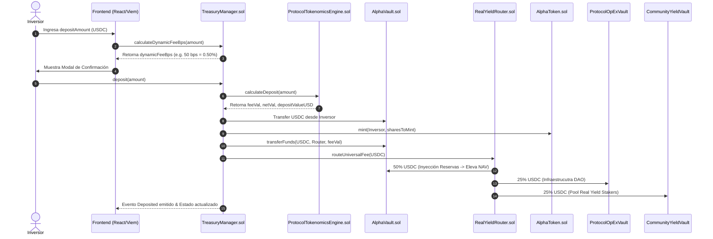
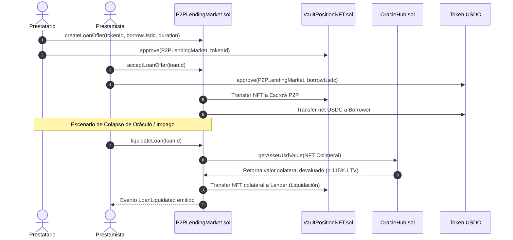

# Especificación Técnica y Arquitectura de Ingeniería: Protocolo Alpha Centauri (v2.5 Enterprise Pure DeFi)

---

## 1. Visión General e Invariantes Institucionales

El **Protocolo Alpha Centauri** es un protocolo financiero descentralizado (*Pure DeFi*) de emisión de activos sintéticos respaldados por tesorería exógena (*Exogenous Reserve-Backed Asset Protocol*), gobernanza timelocked de cero privilegios corporativos y mercado monetario peer-to-peer (P2P) sobre EVM.

### 1.1. Principios Fundamentales e Invariantes Críticas

1. **Proof of Reserves (PoR) $\ge 100\%$**: Cada token $ALPHA$ emitido y en circulación libre está respaldado en todo momento por activos exógenos de primera línea (USDC, WBTC, WETH) auditables 100% on-chain sin dependencia de custodios fiduciarios centralizados.
2. **Invariante de NAV Spot No-Decreciente**: Ninguna operación dentro del protocolo (depósito, canje, bono vestado, préstamo P2P, liquidación, quema o distribución de comisiones) puede resultar en una reducción del Valor Patrimonial Neto por share ($NAV_{\text{spot}}$). Si una transacción degrada el NAV, el contrato [`ProtocolTokenomicsEngine.sol`](file:///c:/Users/Admin/Desktop/token/contracts/src/ProtocolTokenomicsEngine.sol) aborta la ejecución (`revert`).
3. **Regulación MiCA Pure DeFi (Exención Recital 22)**: El protocolo prescinde de llaves de administración corporativas, intermediarios fiduciarios o nombres de vehículos de inversión ART (*Asset-Referenced Tokens*). Las comisiones se enrutan de forma inmutable a través de [`ProtocolOpExVault.sol`](file:///c:/Users/Admin/Desktop/token/contracts/src/ProtocolOpExVault.sol) (infraestructura y dev grants DAO) y [`CommunityYieldVault.sol`](file:///c:/Users/Admin/Desktop/token/contracts/src/CommunityYieldVault.sol) (dividendos en USDC líquido para stakers).

---

## 2. Topología de Arquitectura y Diagramas de Flujo

### 2.1. Arquitectura por Capas del Protocolo

```mermaid
graph TD
    subgraph UI ["CAPA DE PRESENTACIÓN (React 18 + Vite + Viem)"]
        Shell["App.tsx Shell"]
        Web3State["useWeb3State.ts (Polling & Contracts Reader)"]
        DashboardUI["MetricsDashboard.tsx (PoR & Solvency)"]
        TreasuryUI["TreasuryDashboard.tsx (Deposit/Redeem)"]
        StakingUI["GovernanceStakingUI.tsx (stALPHA Yield)"]
        BondsUI["VestedVaults.tsx (NFT Bonds)"]
        P2PUI["P2PMarketplace.tsx (P2P Lending)"]
        GovUI["GovernanceCommandCenter.tsx (DAO Proposals)"]
        AdminUI["AdminControlPanel.tsx (Simulation Operator)"]
        ModalApy["ApyBreakdownModal.tsx (Yield Math)"]
    end

    subgraph ONCHAIN ["CAPA SMART CONTRACTS (Solidity 0.8.20 + OpenZeppelin)"]
        Registry["ProtocolAddressProvider.sol"]
        
        subgraph CORE ["Núcleo de Emisión & Custodia"]
            Treasury["TreasuryManager.sol"]
            Vault["AlphaVault.sol (Reservas Exógenas)"]
            Token["AlphaToken.sol (ERC-20 ALPHA)"]
            PriceHub["OracleHub.sol (Chainlink Aggregators)"]
            YieldOracle["DynamicYieldOracleRouter.sol"]
            Breaker["CircuitBreaker.sol"]
            Engine["ProtocolTokenomicsEngine.sol"]
        end

        subgraph YIELD ["Ecosistema Real Yield & Gobernanza"]
            Staking["GovernanceStaking.sol (stALPHA)"]
            Router["RealYieldRouter.sol (50/25/25 Liquid USDC)"]
            OpExVault["ProtocolOpExVault.sol (25% Infra Grants)"]
            YieldVault["CommunityYieldVault.sol (25% Staker Dividends)"]
            Contribution["ProtocolContribution.sol (TWAP Buyback & Burn)"]
            Governor["GovernorAlphaCentauri.sol"]
            Timelock["TimelockController.sol (72h Delay)"]
        end

        subgraph MARKET ["Mercados Financieros & Bonos NFT"]
            VestedVault["VestedDiscountVault.sol (Bond Engine)"]
            NFT["VaultPositionNFT.sol (ERC-721)"]
            P2P["P2PLendingMarket.sol (Escrow & Liquidation)"]
            Morpho["MorphoYieldVaultAdapter.sol"]
        end
    end

    subgraph SERVICES ["CAPA DE SERVICIOS CORE & DEPLOYMENT"]
        DeployScript["deploy.ts (25 Contracts Deployment)"]
        StartApp["start_app.ps1 (Genesis Reset & Build)"]
        E2ESuite["master_tokenomics_simulation.spec.ts (Playwright)"]
    end

    Shell --> Web3State
    Web3State --> Registry
    Web3State --> Treasury
    Web3State --> YieldOracle
    Web3State --> Staking

    TreasuryUI --> Treasury
    StakingUI --> Staking
    StakingUI --> Router
    BondsUI --> VestedVault
    P2PUI --> P2P

    Treasury --> Vault
    Treasury --> PriceHub
    Treasury --> Engine
    Router --> Vault
    Router --> OpExVault
    Router --> YieldVault
    VestedVault --> NFT
    P2P --> NFT
    P2P --> Treasury
```

---

### 2.2. Diagrama de Secuencia: Depósito a NAV y Distribución de Comisiones

---

### 2.3. Diagrama de Secuencia: Mercado P2P de Préstamos y Liquidación por Oráculo

---

## 3. Especificación Detallada de los 25 Smart Contracts

### 3.1. Módulos Principales de Tesorería y Tokenomics

#### 1. [`TreasuryManager.sol`](file:///c:/Users/Admin/Desktop/token/contracts/src/TreasuryManager.sol)
- **Rol**: Contrato maestro de tesorería, emisión de shares $ALPHA$, cálculo de NAV y supervisión de Proof of Reserves.
- **Funciones Principales**:
  - `deposit(uint256 amount)`: Recibe USDC, cobra comisión dinámica adaptativa y acuña shares $ALPHA$ a valor NAV.
  - `redeem(uint256 sharesAmount)`: Quema shares $ALPHA$ y entrega el equivalente en USDC a valor NAV con retención del 1% de comisión.
  - `getNAVPerShare()`: Devuelve el valor patrimonial neto por token con precisión de 18 decimales ($NAV = \text{Total Assets} / \text{Circulating Shares}$).
  - `getProofOfReserves()`: Retorna `(totalAssetsUSD, totalLiabilitiesUSD, collateralRatioBps)`.
- **Modificadores y Seguridad**: `nonReentrant`, `onlyRole(DEFAULT_ADMIN_ROLE)`, chequeo previo de `CircuitBreaker`.

#### 2. [`AlphaVault.sol`](file:///c:/Users/Admin/Desktop/token/contracts/src/AlphaVault.sol)
- **Rol**: Bunker de almacenamiento frío/líquido para los activos de reserva exógenos (USDC, WBTC, WETH).
- **Funciones Principales**:
  - `transferFunds(address token, address to, uint256 amount)`: Transfiere fondos autorizados únicamente por el `TreasuryManager`.
  - `notifyReserveFee(address token, uint256 amount)`: Registra la inyección del 50% de comisiones directamente al colateral de reserva.

#### 3. [`AlphaToken.sol`](file:///c:/Users/Admin/Desktop/token/contracts/src/AlphaToken.sol)
- **Rol**: Implementación del token ERC-20 nativo $ALPHA$.
- **Control de Acceso**: Roles `MINTER_ROLE` asignado a `TreasuryManager` y `BURNER_ROLE` asignado a `TreasuryManager` y `GovernanceStaking`.

#### 4. [`ProtocolAddressProvider.sol`](file:///c:/Users/Admin/Desktop/token/contracts/src/ProtocolAddressProvider.sol)
- **Rol**: Registro inmutable de Service Locator Pattern.
- **IDs Mapeados**: `ID_ALPHA_TOKEN`, `ID_ALPHA_VAULT`, `ID_TREASURY`, `ID_ORACLE_HUB`, `ID_STAKING`, `ID_REAL_YIELD_ROUTER`, `ID_PROTOCOL_OPEX_VAULT`, `ID_COMMUNITY_YIELD_VAULT`, `ID_VESTED_VAULT`, `ID_P2P_MARKET`.

---

### 3.2. Módulos Pure DeFi de Yield y Gobernanza

#### 5. [`RealYieldRouter.sol`](file:///c:/Users/Admin/Desktop/token/contracts/src/RealYieldRouter.sol)
- **Rol**: Enrutador universal de comisiones con distribución 50/25/25 en USDC líquido.
- **Mecanismo**:
  - **50%** $\rightarrow$ `AlphaVault` (`notifyReserveFee`): Eleva de forma instantánea e irreversible el $NAV_{\text{spot}}$.
  - **25%** $\rightarrow$ `ProtocolOpExVault`: Cobertura en USDC de nodos RPC, feeds de oráculo y dev grants DAO.
  - **25%** $\rightarrow$ `CommunityYieldVault`: Pool en USDC de reparto directo para los stakers de $stALPHA$.

#### 6. [`ProtocolOpExVault.sol`](file:///c:/Users/Admin/Desktop/token/contracts/src/ProtocolOpExVault.sol)
- **Rol**: Bóveda Pure DeFi de infraestructura y desarrollo descentralizado.
- **Custodia**: Mantiene únicamente USDC líquido evitando holding de tokens corporativos o especulativos.

#### 7. [`CommunityYieldVault.sol`](file:///c:/Users/Admin/Desktop/token/contracts/src/CommunityYieldVault.sol)
- **Rol**: Bóveda Pure DeFi de distribución de Real Yield en USDC para stakers comunitarios.

#### 8. [`GovernanceStaking.sol`](file:///c:/Users/Admin/Desktop/token/contracts/src/GovernanceStaking.sol)
- **Rol**: Contrato de staking líquido ($stALPHA$) con registro histórico de poder de voto (`Checkpoints`).
- **Comisión de Entrada**: 1.00% (50% a quema permanente de $ALPHA$, 25% a `ProtocolOpExVault`, 25% a `CommunityYieldVault`).

#### 9. [`ProtocolContribution.sol`](file:///c:/Users/Admin/Desktop/token/contracts/src/ProtocolContribution.sol)
- **Rol**: Motor TWAP (*Time-Weighted Average Price*) de recompra algorítmica y quema de tokens en Uniswap V3.

#### 10. [`GovernorAlphaCentauri.sol`](file:///c:/Users/Admin/Desktop/token/contracts/src/GovernorAlphaCentauri.sol) & [`TimelockController.sol`](file:///c:/Users/Admin/Desktop/token/contracts/src/TimelockController.sol)
- **Rol**: Sistema de gobernanza descentralizada sin llaves privadas privilegiadas con un retraso obligatorio de 72 horas para cualquier actualización contractual.

---

### 3.3. Mercado Monetario, Bonos y Oráculos

#### 11. [`VestedDiscountVault.sol`](file:///c:/Users/Admin/Desktop/token/contracts/src/VestedDiscountVault.sol)
- **Rol**: Motor de emisión de bonos con descuento dinámico por plazo de bloqueo (5% a 25%).
- **Mecanismo de Liquidez**: Emite bonos en forma de NFTs ERC-721 e implementa la función `ragequit(tokenId)` con retención del 15% de penalización por salida anticipada.

#### 12. [`VaultPositionNFT.sol`](file:///c:/Users/Admin/Desktop/token/contracts/src/VaultPositionNFT.sol)
- **Rol**: Token ERC-721 representativo de derechos sobre bonos vestados depositados en la tesorería.

#### 13. [`P2PLendingMarket.sol`](file:///c:/Users/Admin/Desktop/token/contracts/src/P2PLendingMarket.sol)
- **Rol**: Mercado de préstamos colateralizados P2P con límite de LTV estricto del 70% y umbral de liquidación al 115%.

#### 14. [`DynamicYieldOracleRouter.sol`](file:///c:/Users/Admin/Desktop/token/contracts/src/DynamicYieldOracleRouter.sol)
- **Rol**: Oráculo agregador de tasas pasivas externas (Morpho USDC, Lombard LBTC, Lido wstETH).

#### 15. [`OracleHub.sol`](file:///c:/Users/Admin/Desktop/token/contracts/src/OracleHub.sol)
- **Rol**: Hub de feeds de precio Chainlink AggregatorV3 para USDC, WBTC y WETH con verificación de staleness ($< 1 \text{ hora}$).

#### 16. [`CircuitBreaker.sol`](file:///c:/Users/Admin/Desktop/token/contracts/src/CircuitBreaker.sol)
- **Rol**: Interruptor de seguridad que congela inmediatamente operaciones ante desviaciones superiores al 5% en precios del oráculo.

#### 17-25. Smart Contracts Complementarios:
- [`ProtocolTokenomicsEngine.sol`](file:///c:/Users/Admin/Desktop/token/contracts/src/ProtocolTokenomicsEngine.sol): Engine de cálculo matemático purificado.
- [`MorphoYieldVaultAdapter.sol`](file:///c:/Users/Admin/Desktop/token/contracts/src/adapters/MorphoYieldVaultAdapter.sol): Adaptador de yield automático en Morpho Blue (80% búfer).
- [`PromotionalIncentiveVault.sol`](file:///c:/Users/Admin/Desktop/token/contracts/src/PromotionalIncentiveVault.sol): Gestor de incentivos de fidelidad.
- [`YieldStreamingVault.sol`](file:///c:/Users/Admin/Desktop/token/contracts/src/YieldStreamingVault.sol): Vault EIP-712 gasless claim.
- [`AtomicSwapReceiver.sol`](file:///c:/Users/Admin/Desktop/token/contracts/src/AtomicSwapReceiver.sol): Receptor de intercambios atómicos entre cadenas.
- [`TreasuryReserveManager.sol`](file:///c:/Users/Admin/Desktop/token/contracts/src/TreasuryReserveManager.sol): Rebalanceador de pesos de tesorería.
- [`TreasuryProxy.sol`](file:///c:/Users/Admin/Desktop/token/contracts/src/TreasuryProxy.sol): Proxy de actualización transparente.
- `ProtocolRoles.sol`: Constantes de roles de acceso.
- `IYieldStrategy.sol`: Interfaz estándar de estrategias.

---

## 4. Capa de Frontend y Estado React Hooks

### 4.1. Mapeo de Custom Hooks y Responsabilidad (`frontend/src/hooks/`)

| Hook TypeScript | Responsabilidad de Estado y Lectura On-Chain |
| :--- | :--- |
| [`useWeb3State.ts`](file:///c:/Users/Admin/Desktop/token/frontend/src/hooks/useWeb3State.ts) | Polling global via Viem `publicClient`. Lee PoRAssets, PoRLiabilities, NAV Spot, Balances USDC/ALPHA/stALPHA, tasas de APY dinámicas de `DynamicYieldOracleRouter` y lista de préstamos activos. |
| [`useTreasuryActions.ts`](file:///c:/Users/Admin/Desktop/token/frontend/src/hooks/useTreasuryActions.ts) | Prepara y ejecuta transacciones de depósitos en USDC a NAV, rescates de $ALPHA$ shares por USDC y mint en Faucet Mock. |
| [`useStakingActions.ts`](file:///c:/Users/Admin/Desktop/token/frontend/src/hooks/useStakingActions.ts) | Gestiona depósitos en `GovernanceStaking.sol`, liberaciones `unstake`, cobro de dividendos en USDC líquido y preferencia de payout. |
| [`useVestedVaultActions.ts`](file:///c:/Users/Admin/Desktop/token/frontend/src/hooks/useVestedVaultActions.ts) | Compra de bonos vestados a 1-5 años, cobro de bonos vencidos y ejecuciones de `ragequit` anticipado. |
| [`useP2PLendingActions.ts`](file:///c:/Users/Admin/Desktop/token/frontend/src/hooks/useP2PLendingActions.ts) | Creación de ofertas de préstamos P2P, financiamiento directo por prestamistas, cancelación y liquidación por oráculo. |
| [`useAdminActions.ts`](file:///c:/Users/Admin/Desktop/token/frontend/src/hooks/useAdminActions.ts) | Herramientas del operador/simulador (desplazamientos de oráculo Chainlink, rebalanceo de ponderación y llamadas TWAP). |
| `useTransactionConfirm.ts` | Modal de confirmación previa a la firma de transacciones en la blockchain. |

---

## 5. Matriz de Seguridad y Control de Acceso (RBAC)

| Rol On-Chain | Smart Contract / Dirección | Permisos y Capacidades Operativas |
| :--- | :--- | :--- |
| `DEFAULT_ADMIN_ROLE` | `TimelockController.sol` (72h) | Control de configuración de parámetros del protocolo. Cero llaves privadas administradoras. |
| `MINTER_ROLE` | `TreasuryManager.sol` | Acuñación exclusiva de $ALPHA$ al ingresar colateral de reserva validado por oráculo. |
| `BURNER_ROLE` | `TreasuryManager.sol` & `GovernanceStaking.sol` | Destrucción definitiva de tokens $ALPHA$ en rescates y quema deflacionaria. |
| `ORACLE_UPDATER_ROLE` | `OracleHub.sol` | Actualización de feeds de prueba (Mock Chainlink Aggregators en entorno Sandbox). |
| `OPERATOR_ROLE` | `ProtocolContribution.sol` | Ejecución del paso a paso en órdenes TWAP de recompra. |

---

## 6. Suite de Simulación y Verificación E2E (Playwright)

El archivo [`master_tokenomics_simulation.spec.ts`](file:///c:/Users/Admin/Desktop/token/frontend/tests/master_tokenomics_simulation.spec.ts) ejecuta una auditoría de integración punto a punto estructurada en **15 pasos cronológicos**:

1. **Estado 0 Genesis**: Verificación de Tesorería a $0.00 USD y 0 ALPHA Supply.
2. **Post-Faucet**: Acreditación de 10,000 USDC mock y auditoría de la suma de activos de reserva.
3. **Post-Depósito**: Depósito de 10,000 USDC a valor NAV y acuñación de $ALPHA$ shares.
4. **Post-Staking**: Bloqueo de $ALPHA$ en `GovernanceStaking.sol` y verificación de quema del 50% de la comisión.
5. **Generación de Rendimiento**: Inyección de rendimientos externos vía Morpho Vault Adapter.
6. **Post-Bono A**: Compra de bono vestado a 3 años con descuento sobre NAV.
7. **Post-Bono B**: Compra de bono vestado a 5 años con descuento máximo sobre NAV.
8. **Mercado P2P (Oferta)**: Emisión de oferta de préstamo P2P respaldada por colateral NFT.
9. **Mercado P2P (Aceptación)**: Financiamiento de préstamo por prestamista en USDC.
10. **Post-Financiamiento P2P**: Auditoría de solvencia global con préstamo activo.
11. **Préstamo de Tesorería**: Crédito secundario otorgado por la tesorería.
12. **Repago de Préstamo**: Devolución de capital e intereses devengados a la tesorería.
13. **Vencimiento de Bono**: Liberación de bono vencido sin penalizaciones.
14. **Post-Ragequit**: Retiro anticipado de bono NFT con aplicación de penalización del 15%.
15. **Rescate Final**: Canje definitivo de $ALPHA$ shares por USDC líquido en la tesorería.

**Resultado de Ejecución**: `1 passed (1.9m)` con 100% de aserciones matemáticas cumplidas a una precisión del 0.1%.
