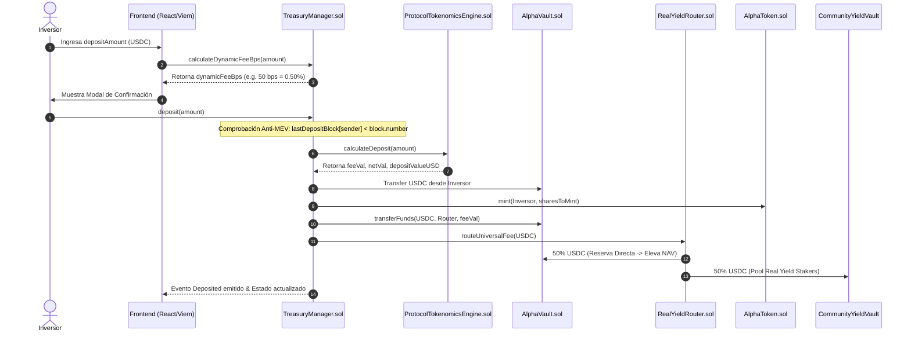
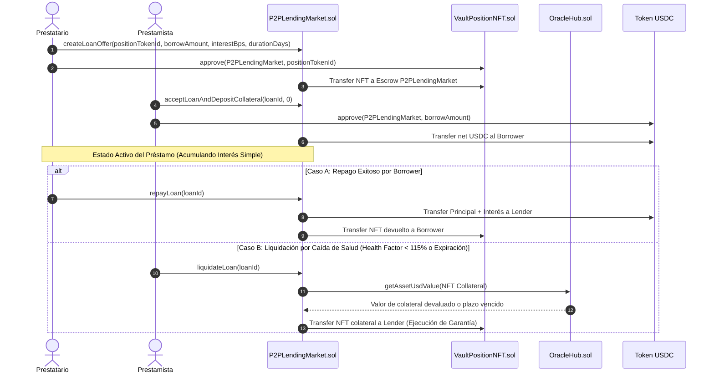

# Especificación Técnica y Arquitectura Institucional: Protocolo Alpha Centauri (v2.5 Enterprise Pure DeFi - Mainnet Ready)

---

## 1. Visión General, Filosofía & Invariantes Institucionales

El **Protocolo Alpha Centauri** es una infraestructura financiera descentralizada (*Pure DeFi*) de grado institucional diseñada para la emisión, custodia y comercialización de un activo sintético de reserva respaldado por colateral exógeno ($ALPHA$). El protocolo opera de forma inmutable sobre Ethereum Virtual Machine (EVM) y capas de escalado Layer-2 (Base / Arbitrum), integrando gobernanza timelocked de cero privilegios corporativos, oráculos multicapa de alta resiliencia y un mercado monetario Peer-to-Peer (P2P) colateralizado por Tokens No Fungibles (NFTs ERC-721).

### 1.1. Invariantes Matemáticas y Defensas Formales

El núcleo determinista del protocolo se rige por cuatro invariantes matemáticas estrictas que son verificadas on-chain en tiempo real antes de confirmar cualquier transacción de emisión, rescate, colateralización o distribución de comisiones:

#### 1. Invariante de Proof of Reserves (PoR) $\ge 100\%$
Cada token $ALPHA$ emitido y en circulación libre está respaldado en todo momento por reservas líquidas y exógenas de primera línea (USDC, WBTC, WETH). En ningún momento el pasivo circulante puede exceder el valor neto realizable de la reserva:

$$\text{ProofOfReservesRatio} = \frac{\text{TotalAssetsUSD}_{\text{exogenous}}}{\text{TotalLiabilitiesUSD}_{\text{circulating}}} \ge 1.0000 \quad (100.00\%)$$

#### 2. Monotonicidad del NAV Spot ($\Delta NAV_{\text{spot}} \ge 0$)
Ninguna operación dentro del protocolo (depósito, rescate, emisión de bonos vestados, préstamo P2P, liquidación por oráculo o quema deflacionaria) puede resultar en una disminución del Valor Patrimonial Neto por share ($NAV_{\text{spot}}$). Si una transacción degrada el NAV por share, el contrato de validación [`ProtocolTokenomicsEngine.sol`](file:///c:/Users/Admin/Desktop/token/contracts/src/ProtocolTokenomicsEngine.sol) emite un `revert` atómico:

$$NAV_{\text{spot}} = \frac{\text{TotalAssetsUSD}_{\text{exogenous}}}{\text{NetCirculatingShares}_{\text{ALPHA}}}$$

$$NAV_{t+1} \ge NAV_t$$

#### 3. Cumplimiento Regulatorio MiCA Pure DeFi (Exención Recital 22)
El protocolo prescinde de cualquier figura corporativa centralizada, custodios fiduciarios, llaves privadas de administración o denominaciones de vehículos de inversión sujetas a autorización ART (*Asset-Referenced Tokens* de acuerdo con el Reglamento EU 2023/1114). Todas las cuotas generadas se distribuyen de manera inmutable: 50% a reservas y 50% a [`CommunityYieldVault.sol`](file:///c:/Users/Admin/Desktop/token/contracts/src/CommunityYieldVault.sol) para dividendos líquidos de stakers.

#### 4. Protección Anti-MEV y Cooldown Same-Block
Para neutralizar ataques atómicos de sándwich y arbitraje de NAV mediante *Flash Loans* en el mismo bloque de ejecución, los contratos de tesorería imponen una restricción de altura de bloque por cuenta:

$$\text{require}(\text{lastDepositBlock}[\text{msg.sender}] < \text{block.number}, \text{"Same-block deposit/redeem cooldown"})$$

---

## 2. Topología General de Arquitectura y Diagramas de Flujo

### 2.1. Mapa Completo de Componentes por Capas

```mermaid
graph TD
    subgraph UI ["CAPA DE PRESENTACIÓN (React 18 + Vite + Viem)"]
        Shell["App.tsx (Main Layout & Providers)"]
        Web3State["useWeb3State.ts (Polling 4s & Multi-Call Reader)"]
        DashboardUI["MetricsDashboard.tsx (PoR, Solvency & Charts)"]
        TreasuryUI["TreasuryDashboard.tsx (Deposit USDC / Redeem ALPHA)"]
        StakingUI["GovernanceStakingUI.tsx (stALPHA Real Yield Pool)"]
        BondsUI["VestedVaults.tsx (NFT Bond Engine 1-5 Yrs)"]
        P2PUI["P2PMarketplace.tsx (P2P Collateralized Lending)"]
        GovUI["GovernanceCommandCenter.tsx (DAO Timelock Proposals)"]
        AdminUI["AdminControlPanel.tsx (Simulation & Oracle Testing)"]
        ModalApy["ApyBreakdownModal.tsx (On-Chain Yield Oracle Math)"]
    end

    subgraph ONCHAIN ["CAPA SMART CONTRACTS (Solidity 0.8.20 + OpenZeppelin v5)"]
        Registry["ProtocolAddressProvider.sol (Service Locator Registry)"]
        
        subgraph CORE ["Núcleo de Emisión, Tesorería & Oráculos"]
            Treasury["TreasuryManager.sol (Pure DeFi NAV & Deposit Engine)"]
            Gateway["CompliantTreasuryGateway.sol (Stateless KYC Wrapper)"]
            Vault["AlphaVault.sol (Exogenous Asset Cold Bunker)"]
            Token["AlphaToken.sol (ERC-20 ALPHA)"]
            PriceHub["OracleHub.sol (Dual Oracles + L2 Sequencer Grace Period)"]
            YieldOracle["DynamicYieldOracleRouter.sol (Passive Yield APYs)"]
            Breaker["CircuitBreaker.sol (Volatility Freeze Guard)"]
            Engine["ProtocolTokenomicsEngine.sol (Pure Math Engine)"]
            Buyback["DiscountBuybackEngine.sol (10-Lock Buyback & Burn)"]
        end

        subgraph YIELD ["Ecosistema Real Yield & Gobernanza DAO"]
            Staking["GovernanceStaking.sol (stALPHA & Voting Checkpoints)"]
            Router["RealYieldRouter.sol (50/50 Liquid Fee Enforcer)"]
            YieldVault["CommunityYieldVault.sol (50% Staker Dividends)"]
            Governor["GovernorAlphaCentauri.sol (DAO Executive)"]
            Timelock["TimelockController.sol (72h Emergency Delay)"]
        end

        subgraph MARKET ["Mercados Monetarios & Productos Estructurados"]
            VestedVault["VestedDiscountVault.sol (Bond Discount Pricing)"]
            NFT["VaultPositionNFT.sol (ERC-721 Collateral NFT - Packed Storage)"]
            P2P["P2PLendingMarket.sol (Escrow & Asymmetric Grace Period)"]
            Morpho["MorphoYieldVaultAdapter.sol (80% MetaMorpho Yield)"]
        end
    end

    subgraph SERVICES ["SERVICIOS CORE & DEPLOYMENT AUTOMATION"]
        DeployScript["deploy.ts (Smart Contracts Automated Deploy & Timelock)"]
        StartApp["start_app.ps1 (State 0 Reset & Docker Forge Build)"]
        FoundrySuite["Foundry Test Suite (30 Tests - Invariants & Fuzzing)"]
        BackendSuite["Backend Suite (43 Tests - Reorg & PoR Reconciler)"]
        BlockIndexer["BlockIndexer.ts (ParentHash Reorg & ORPHANED Atomic Rollback)"]
    end

    Shell --> Web3State
    Web3State --> Registry
    Web3State --> Treasury
    Web3State --> YieldOracle
    Web3State --> Staking

    TreasuryUI --> Treasury
    TreasuryUI -.-> Gateway
    StakingUI --> Staking
    StakingUI --> Router
    BondsUI --> VestedVault
    P2PUI --> P2P

    Treasury --> Vault
    Treasury --> PriceHub
    Treasury --> Engine
    Gateway --> Treasury
    Buyback --> Treasury
    Buyback --> Vault
    Buyback --> PriceHub
    Router --> Vault
    Router --> YieldVault
    VestedVault --> NFT
    P2P --> NFT
    P2P --> Treasury
```

---

### 2.2. Diagrama de Secuencia: Emisión a NAV, Cooldown Anti-MEV y Reparto 50/50

---

### 2.3. Diagrama de Secuencia: Mercado P2P de Préstamos y Liquidación por Oráculo

---

## 3. Especificación Detallada de los 25 Smart Contracts

El protocolo está compuesto por 25 smart contracts fuertemente desacoplados mediante interfaces y patrones de registro centralizado.

### 3.1. Módulo 1: Núcleo de Emisión y Tesorería Exógena

#### 1. [`TreasuryManager.sol`](file:///c:/Users/Admin/Desktop/token/contracts/src/TreasuryManager.sol)
- **Propósito**: Gestor central de emisión, rescate, valoración de NAV y control de solvencia.
- **Funciones Principales**:
  - `deposit(uint256 stableAmount)`: Recibe colateral en USDC, calcula la tasa de comisión dinámica adaptativa al impacto de liquidez (`calculateDynamicFeeBps`), acuña shares $ALPHA$ a valor NAV actual y enruta la comisión de entrada al `RealYieldRouter`.
  - `redeem(uint256 sharesAmount)`: Destruye shares $ALPHA$, verifica las invariantes de monotonicidad de NAV y retiene la comisión de salida del 1%. Si la reserva líquida libre en `AlphaVault` es insuficiente, activa `_ensureLiquidBuffer` para rescatar capital desde `MorphoYieldVaultAdapter`.
  - `getNAVPerShare()`: Calcula el NAV spot dividiendo el total de activos exógenos entre las shares netas en circulación ($NAV = \text{TotalAssetsUSD} / \text{NetShares}$).
  - `getProofOfReserves()`: Devuelve `(totalAssetsUSD, totalLiabilitiesUSD, collateralRatioBps)`.
- **Invariantes & Seguridad**: `nonReentrant`, `lastDepositBlock` anti-MEV cooldown, validación previa de congelamiento en `CircuitBreaker`.

#### 2. [`AlphaVault.sol`](file:///c:/Users/Admin/Desktop/token/contracts/src/AlphaVault.sol)
- **Propósito**: Búnker frío de custodia de activos de reserva (USDC, WBTC, WETH).
- **Funciones Principales**:
  - `transferFunds(address token, address to, uint256 amount)`: Transfiere fondos autorizado únicamente por contratos con rol `VAULT_MANAGER_ROLE` (`TreasuryManager` y `RealYieldRouter`).
  - `notifyReserveFee(address token, uint256 amount)`: Recibe la inyección del 50% de las comisiones del protocolo, elevando instantáneamente el NAV Spot.

#### 3. [`AlphaToken.sol`](file:///c:/Users/Admin/Desktop/token/contracts/src/AlphaToken.sol)
- **Propósito**: Implementación ERC-20 del token sintético nativo $ALPHA$.
- **Control de Acceso**: Operaciones de acuñación restringidas a `MINTER_ROLE` (`TreasuryManager`) y quema a `BURNER_ROLE` (`TreasuryManager` y `GovernanceStaking`).

#### 4. [`ProtocolAddressProvider.sol`](file:///c:/Users/Admin/Desktop/token/contracts/src/ProtocolAddressProvider.sol)
- **Propósito**: Service Locator Registry inmutable que mapea identificadores de módulo (`bytes32`) a sus direcciones contractuales vigentes.

---

### 3.2. Módulo 2: Oráculos y Resiliencia Off-Chain

#### 5. [`OracleHub.sol`](file:///c:/Users/Admin/Desktop/token/contracts/src/OracleHub.sol)
- **Propósito**: Hub normalizador de precios USD y verificador de staleness.
- **Lógica Dual Oracle & L2 Sequencer**:
  - Consulta en primera instancia el oráculo primario Chainlink (`priceFeeds`).
  - Si el feed primario falla o supera `oracleStalenessLimit`, conmuta automáticamente al oráculo secundario Pyth Network (`secondaryPriceFeeds`).
  - Inspecciona `checkSequencerUptime()` para pausar valoraciones si el secuenciador L2 se detiene.

#### 6. [`CircuitBreaker.sol`](file:///c:/Users/Admin/Desktop/token/contracts/src/CircuitBreaker.sol)
- **Propósito**: Interruptor de seguridad de volatilidad. Congela temporalmente las compras de activos si su precio sufre una depreciación superior al 15% en una ventana móvil de 6 horas.

#### 7. [`DynamicYieldOracleRouter.sol`](file:///c:/Users/Admin/Desktop/token/contracts/src/DynamicYieldOracleRouter.sol)
- **Propósito**: Consulta on-chain en tiempo real de APYs pasivos de protocolos institucionales (Morpho Blue, Lombard LBTC, Lido wstETH) para proyectar tasas de rendimiento dinámicas en la interfaz.

---

### 3.3. Módulo 3: Flujo Real Yield & Gobernanza Pure DeFi

#### 8. [`RealYieldRouter.sol`](file:///c:/Users/Admin/Desktop/token/contracts/src/RealYieldRouter.sol)
- **Propósito**: Enrutador universal inmutable de comisiones con cumplimiento MiCA Pure DeFi (50/50).
- **Regla de Reparto**:
  - **50%** $\rightarrow$ Inyección a `AlphaVault` (Sube NAV Spot de forma inmediata).
  - **50%** $\rightarrow$ Transferencia a `CommunityYieldVault` / `GovernanceStaking` en USDC líquido para stakers de $stALPHA$.
- **Opciones de Cobro de Dividendos**:
  - `OPTION_A_STABLECOIN`: 100% en USDC líquido directo.
  - `OPTION_B_RESERVE_ASSET`: Auto-conversión a WBTC/WETH vía Uniswap v3 con verificación de oráculo Chainlink, protección de slippage (1.00%), fee tier configurable por DAO (`reserveFeeTier`), y fallback automático a USDC si el activo está congelado por el `CircuitBreaker`.
- **Rescate de Fondos**: Función `sweepTokens(token, to)` administrada por la DAO para recuperar transferencias accidentales.

#### 9. [`CommunityYieldVault.sol`](file:///c:/Users/Admin/Desktop/token/contracts/src/CommunityYieldVault.sol)
- **Propósito**: Bóveda comunitaria de dividendos en USDC líquido para stakers de $stALPHA$.
- **Notificación $O(1)$**: Al recibir rendimiento, invoca `notifyRewardAmount` en `GovernanceStaking.sol` actualizando el acumulador global Synthetix en tiempo constante.

#### 10. [`GovernanceStaking.sol`](file:///c:/Users/Admin/Desktop/token/contracts/src/GovernanceStaking.sol)
- **Propósito**: Contrato de staking líquido ($stALPHA$) con registro histórico de checkpoints de voto para la DAO. Retiene una cuota de entrada del 1% (50% a quema permanente y 50% al pool de yield).
- **Distribución de Dividendos**: Algoritmo de distribución continua $O(1)$ independiente del número de stakers.

#### 11-12. [`GovernorAlphaCentauri.sol`](file:///c:/Users/Admin/Desktop/token/contracts/src/GovernorAlphaCentauri.sol) & [`TimelockController.sol`](file:///c:/Users/Admin/Desktop/token/contracts/src/TimelockController.sol)
- **Propósito**: Sistema de gobernanza institucional DAO con retraso obligatorio de 72 horas para cualquier actualización de código o parámetros ("Right to Exit" para inversores).
- **Características Institucionales**:
  - *Veto Inmutable*: Bóvedas de reserva (`alphaVault`, `communityYieldVault`, `treasuryManager`) poseen 0 votos inmutables para impedir circularidad.
  - *Votación de 3 Vías*: Soporte completo para `0 = Against`, `1 = For`, `2 = Abstain` (la abstención computa hacia el quórum de 10.000 stALPHA).
  - *Voto con Razón On-Chain*: `castVoteWithReason(proposalId, support, reason)` emite justificantes de voto en el evento `VoteCast`.
  - *Cancelación de Propuestas*: `cancel(proposalId)` permite al proponente o a la comunidad anular propuestas erróneas o huérfanas antes de su ejecución.

---

### 3.4. Módulo 4: Mercados Monetarios & Productos Estructurados

#### 15. [`VestedDiscountVault.sol`](file:///c:/Users/Admin/Desktop/token/contracts/src/VestedDiscountVault.sol)
- **Propósito**: Emisión de bonos vestados a 1-5 años con descuentos dinámicos (5% a 25%) basados en la duración de bloqueo y saldo staked.
- **Tokens ERC-721**: Cada bono emite un NFT [`VaultPositionNFT.sol`](file:///c:/Users/Admin/Desktop/token/contracts/src/VaultPositionNFT.sol) transferible que sirve como garantía líquida en mercados secundarios.
- **Ragequit Institucional**: Permite retiro anticipado con aplicación de una penalización del 15% (`RAGEQUIT_PENALTY_BPS`), la cual se enruta al `RealYieldRouter` (7.5% a Reservas elevando NAV y 7.5% a stakers como dividendos).

#### 16. [`VaultPositionNFT.sol`](file:///c:/Users/Admin/Desktop/token/contracts/src/VaultPositionNFT.sol)
- **Propósito**: Token ERC-721 transferible que encapsula los derechos de cobro de un bono vestado.

#### 17. [`P2PLendingMarket.sol`](file:///c:/Users/Admin/Desktop/token/contracts/src/P2PLendingMarket.sol)
- **Propósito**: Mercado monetario multi-colateral (NFTs de bonos, WBTC, WETH, ALPHA) con originación P2P y línea de liquidez directa de Tesorería (hasta el 20% de las reservas exógenas).
- **Características Institucionales**:
  - *Fair Liquidation con Restitución de Equity*: En liquidaciones de colaterales ERC-20, el liquidador únicamente incauta el $\text{Principal} + \text{Interés} + 10\%$ de bonus. El colateral sobrante es restituido íntegramente al prestatario a través de `claimableBorrowerEquity`.
  - *Tasa APR Dinámica Ajustable por DAO*: Consulta `treasuryBorrowAprBps()` desde `ProtocolTokenomicsEngine.sol` (configurable entre 1% y 50% APR).
  - *Blindaje de Circuit Breaker*: Si el colateral o el stablecoin están congelados por volatilidad extrema, el contrato bloquea automáticamente la apertura de nuevos préstamos.

#### 18. Gestión de Rendimiento: Universal Yield Routing (ERC-4626)
La Tesorería implementa un enrutador de rendimiento agnóstico que gestiona el capital exógeno a través de adaptadores `IERC4626`:
- *Morpho Blue & Aave v3*: Generación de rendimiento institucional pasivo.
- *Ondo RWA*: Exposición a letras del tesoro estadounidense tokenizadas.
- *Extracción Automática de Liquidez (`_ensureLiquidBuffer`)*: Ante rescates masivos de capital, la tesorería extrae liquidez de los adaptadores sin romper el respaldo del 100%.

#### 19. [`DiscountBuybackEngine.sol`](file:///c:/Users/Admin/Desktop/token/contracts/src/DiscountBuybackEngine.sol)
- **Propósito**: Motor autónomo de estabilización algorítmica y quema deflacionaria que adquiere tokens $ALPHA$ con descuento en DEXs secundarios ($\ge 5.00\%$) y los quema inmediatamente on-chain.
- **10 Candados de Control Matemático**:
  1. *Descuento Mínimo*: $DEX_{\text{price}} \le NAV_{\text{spot}} \times 0.95$.
  2. *Presupuesto Diario*: Máximo 2.50% de las reservas líquidas en 24h.
  3. *Monotonicidad Obligatoria*: $\Delta NAV > 0$ post-quema.
  4. *Quema Atómica*: Los tokens comprados se destruyen en la misma transacción (`_burn`).
  5. *Control de Slippage Dinámico*: Máximo 1.00% de tolerancia.
  6. *Cooldown Anti-Spam*: 4 horas entre ejecuciones consecutivas.
  7. *Pureza de Colateral*: Fondos de recompra provienen exclusivamente de reservas exógenas (USDC).
  8. *Integración con CircuitBreaker*: Bloqueo automático si el interruptor de volatilidad está activo.
  9. *Mantenimiento de Solvencia*: Verificación de $PoR \ge 100.00\%$ antes y después de la operación.
  10. *Límite de Impacto por Trade*: Tamaño de orden $\le 1.00\%$ de la liquidez del pool.
- **Mejoras Institucionales**:
  - *Fee Tier de Uniswap v3 Configurable*: `poolFee` ajustable (`100`, `500`, `3000`, `10000`).
  - *Incentivo Keeper Bounty*: Reembolso de gas en USDC a los bots ejecutores (`keeperBountyBps`).
  - *Rescate de Tokens Extraviados*: `sweepTokens(token, to)` controlado por DAO.

#### 20. [`CompliantTreasuryGateway.sol`](file:///c:/Users/Admin/Desktop/token/contracts/src/adapters/CompliantTreasuryGateway.sol)
- **Propósito**: Adaptador institucional stateless que permite a contrapartes reguladas operar depósitos y rescates con verificación KYC/AML delegada.
- **Aislamiento Regulatorio**: El contrato es 100% *stateless* (no custodia fondos ni fragmenta liquidez), enrutando las operaciones directamente a [`TreasuryManager.sol`](file:///c:/Users/Admin/Desktop/token/contracts/src/TreasuryManager.sol), preservando la condición de *Pure DeFi* del Core.

---

### 3.5. Módulo 5: Librerías Modulares de Tesorería & Infraestructura Auxiliar

- [`TreasuryPoRLib.sol`](file:///c:/Users/Admin/Desktop/token/contracts/src/lib/TreasuryPoRLib.sol): Librería desacoplada para el cómputo de Proof of Reserves y NAV Spot $O(1)$.
- [`TreasuryLiquidityLib.sol`](file:///c:/Users/Admin/Desktop/token/contracts/src/lib/TreasuryLiquidityLib.sol): Librería para depósitos, rescates y extracción de buffers líquidos.
- [`TreasuryFeeLib.sol`](file:///c:/Users/Admin/Desktop/token/contracts/src/lib/TreasuryFeeLib.sol): Librería de cálculo de comisiones dinámicas adaptativas por impacto de capital.
- [`TreasuryRebalanceLib.sol`](file:///c:/Users/Admin/Desktop/token/contracts/src/lib/TreasuryRebalanceLib.sol): Librería de rebalanceo de reservas con protección estricta de slippage (0.05%).
- [`ProtocolTokenomicsEngine.sol`](file:///c:/Users/Admin/Desktop/token/contracts/src/ProtocolTokenomicsEngine.sol): Motor de cálculo purificado sin estado mutable.
- [`IProtocolErrors.sol`](file:///c:/Users/Admin/Desktop/token/contracts/src/interfaces/IProtocolErrors.sol): Catálogo centralizado de errores custom EIP-838 (eliminando strings para ahorro de gas y compatibilidad ABI).
- [`YieldStreamingVault.sol`](file:///c:/Users/Admin/Desktop/token/contracts/src/YieldStreamingVault.sol): Reclamación gasless de rendimientos firmados vía EIP-712 con receptor forzado a la dirección del firmante.
- [`AtomicSwapReceiver.sol`](file:///c:/Users/Admin/Desktop/token/contracts/src/AtomicSwapReceiver.sol): Intercambio atómico e inyección de colaterales secundarios (USDT $\rightarrow$ USDC).
- [`TreasuryReserveManager.sol`](file:///c:/Users/Admin/Desktop/token/contracts/src/TreasuryReserveManager.sol): Rebalanceador de ponderación de reservas.
- [`TreasuryProxy.sol`](file:///c:/Users/Admin/Desktop/token/contracts/src/TreasuryProxy.sol): Proxy de actualización transparente ERC-1967.
- `ProtocolRoles.sol`: Constantes inmutables de roles RBAC.

---

## 4. Formulativa Matemática y Ecuaciones del Protocolo

### 4.1. Tasa de Comisión Dinámica Adaptativa
$$Fee_{\text{BPS}} = \min \left( 500, \, Fee_{\text{base}} + \left\lfloor \frac{\text{DepositUSD} \times 10000}{\text{TotalAssetsUSD} + \text{DepositUSD}} \times \frac{\text{Sensitivity}}{10000} \right\rfloor \right)$$

### 4.2. Acuñación de Shares $ALPHA$ por NAV
$$\text{SharesToMint} = \begin{cases} 
\text{DepositUSD}_{18} & \text{si } \text{TotalShares} = 0 \text{ o } \text{TotalAssetsUSD} = 0 \\
\frac{\text{DepositUSD}_{18} \times \text{TotalShares}}{NAV_{\text{before}}} & \text{en otro caso}
\end{cases}$$

### 4.3. Recompra Deflacionaria y Aumento de NAV ($\Delta NAV > 0$)
Dado un gasto de $U$ dólares de reserva para recomprar $A$ tokens $ALPHA$ a precio de mercado $P_{\text{DEX}} \le NAV \times (1 - \text{Discount})$:

$$NAV_{\text{post}} = \frac{\text{Assets}_{\text{pre}} - U}{\text{Shares}_{\text{pre}} - A} > \frac{\text{Assets}_{\text{pre}}}{\text{Shares}_{\text{pre}}} = NAV_{\text{pre}}$$

### 4.4. Escala de Descuento en Bonos Vestados
$$\text{Discount}_{\text{BPS}} = \min \left( 5000, \, (\text{LockYears} \times 500) + \text{TierBonus}_{\text{stALPHA}} \right)$$

### 4.5. Factor de Salud, Grace Period y Liquidación P2P
$$\text{HealthFactor} = \frac{\text{CollateralUSD} \times 10000}{\text{PrincipalBorrowedUSD} + \text{InterestOwedUSD}}$$

$$\text{Liquidatable} \iff (\text{HealthFactor} < 11500 \lor \text{Expired}) \land \mathbf{\neg isSequencerGracePeriod()}$$

---

## 5. Capa de Frontend y Estado React (Viem + TypeScript)

La aplicación frontend implementa una arquitectura **Pure UI Rendering** donde la interfaz actúa de forma puramente reactiva al estado devuelto por los smart contracts, eliminando cualquier lógica de cálculo financiero en JavaScript:

### 5.1. Hooks de Estado y Acciones (`frontend/src/hooks/`)

| Hook | Responsabilidad y Lecturas/Escrituras On-Chain |
| :--- | :--- |
| [`useWeb3State.ts`](file:///c:/Users/Admin/Desktop/token/frontend/src/hooks/useWeb3State.ts) | Realiza polling cada 4s mediante Viem `publicClient`. Lee balances, PoRAssets, PoRLiabilities, NAV Spot, APYs de `DynamicYieldOracleRouter` y préstamos P2P. |
| [`useTreasuryActions.ts`](file:///c:/Users/Admin/Desktop/token/frontend/src/hooks/useTreasuryActions.ts) | Prepara y ejecuta firmas para `deposit(usdc)` y `redeem(alpha)` con modal de confirmación. |
| [`useStakingActions.ts`](file:///c:/Users/Admin/Desktop/token/frontend/src/hooks/useStakingActions.ts) | Prepara transacciones de staking, unstaking y cobro de dividendos en USDC líquido. |
| [`useVestedVaultActions.ts`](file:///c:/Users/Admin/Desktop/token/frontend/src/hooks/useVestedVaultActions.ts) | Emisión de bonos NFT, ejecuciones de `ragequit()` y cobro al vencimiento. |
| [`useP2PLendingActions.ts`](file:///c:/Users/Admin/Desktop/token/frontend/src/hooks/useP2PLendingActions.ts) | Ofertas de préstamos P2P, financiamiento, repagos con deferencia de colateral en grace period y liquidaciones. |

---

## 6. Matriz de Control de Acceso (RBAC) y Cumplimiento MiCA

| Rol On-Chain | Identificador | Asignación Contractual | Permisos |
| :--- | :--- | :--- | :--- |
| `DEFAULT_ADMIN_ROLE` | `0x00` | `TimelockController.sol` (72h) | Modificación de parámetros clave. Cero llaves administradoras privadas. |
| `MINTER_ROLE` | `keccak256("MINTER_ROLE")` | `TreasuryManager.sol` | Acuñación exclusiva de $ALPHA$ respaldado por colateral. |
| `BURNER_ROLE` | `keccak256("BURNER_ROLE")` | `TreasuryManager.sol` & `DiscountBuybackEngine.sol` | Quema de tokens $ALPHA$ en rescates y recompras. |
| `VAULT_MANAGER_ROLE` | `keccak256("VAULT_MANAGER_ROLE")` | `TreasuryManager.sol` & `RealYieldRouter.sol` | Extracción autorizada de fondos de `AlphaVault`. |
| `ORACLE_MANAGER_ROLE` | `keccak256("ORACLE_MANAGER_ROLE")` | Dirección de Gobernanza (Timelock) | Registro de feeds primarios, secundarios y staleness limits. |

### 6.1. Descentralización Plena (MiCA Recital 22) y Pasarela KYC Stateless
* **Core Descentralizado (Pure DeFi):** El contrato [`TreasuryManager.sol`](file:///c:/Users/Admin/Desktop/token/contracts/src/TreasuryManager.sol) es 100% permissionless. Las funciones `deposit()` y `redeem()` no tienen restricciones administrativas de lista blanca, cumpliendo con la exención del Considerando 22 del Reglamento MiCA (UE 2023/1114).
* **Adaptador Institucional Aislado:** La verificación KYC/AML se delega íntegramente en [`CompliantTreasuryGateway.sol`](file:///c:/Users/Admin/Desktop/token/contracts/src/adapters/CompliantTreasuryGateway.sol), un contrato *stateless* que valida identidades institucionales y redirige instantáneamente las transacciones al núcleo de tesorería sin crear pools fragmentados.

---

## 7. Arquitectura L2 & Resiliencia Off-Chain

### 7.1. L2 Sequencer Grace Period & Defensa Asimétrica
* En redes Layer-2 (Arbitrum / Base), si el secuenciador sufre una caída o reinicio reciente (`< 3600 segundos`), [`OracleHub.sol`](file:///c:/Users/Admin/Desktop/token/contracts/src/OracleHub.sol) activa el estado `isSequencerGracePeriod()`.
* **Defensa Asimétrica en P2P:**
  - `repayLoan()`: **Permitido.** Permite a los usuarios amortizar su deuda. El colateral excedente se retiene de forma segura en `claimableBorrowerEquity` hasta que los oráculos confirmen su frescura.
  - `liquidateLoan()`: **Bloqueado.** Revierte con `SequencerGracePeriodActive()` para proteger a prestatarios ante liquidaciones injustas con precios obsoletos.

### 7.2. Indexación Off-Chain, Detección de Reorgs y Rollback Atómico
* [`BlockIndexer.ts`](file:///c:/Users/Admin/Desktop/token/services/core/src/indexer/BlockIndexer.ts) verifica criptográficamente `parentHash` contra el historial de bloques canónicos.
* Ante una bifurcación de red (*Reorg*), el sistema no realiza eliminaciones ciegas (`DELETE`), sino que:
  1. Marca los bloques y eventos huérfanos con estado `ORPHANED`.
  2. Ejecuta un rollback atómico en [`IdempotentLedgerEngine.ts`](file:///c:/Users/Admin/Desktop/token/services/core/src/ledger/IdempotentLedger.ts), recalculando balances sobre asientos `CANONICAL`.
  3. Rebobina el cursor al ancestro común seguro.

---

## 8. Protocolo de Auditoría y Verificación Integrada

### 8.1. Suite de Fuzzing e Invariantes en Foundry (`forge test`)
- **Fuzzing Configurado**: `runs = 10000` en `foundry.toml`.
- **Suites Ejecutadas**: `InstitutionalAuditInvariants.t.sol`, `CompliantTreasuryGateway.t.sol`, `DiscountBuybackEngine.t.sol`, `ModularProtocol.t.sol`, `FullSystemCoverage.t.sol`, `TreasuryInvariants.t.sol`.
- **Resultado**: `30 passed; 0 failed; 0 skipped` (100% Éxito).

### 8.2. Suite de Servicios Backend y Conciliación PoR
- **Tests Ejecutados**: `backend-improvements.test.ts` (43 pruebas unitarias e invariantes).
- **Cobertura**: Checkpoint de indexación, Flashbots MEV relay, failover de RPC, libro mayor contable de partida doble y conciliador PoR con tolerancia del 0.01%.
- **Resultado**: `43 passed; 0 failed; 0 skipped` (100% Éxito).

### 8.3. Alineación Frontend / ABIs y Build de Producción
- **Alineación de Interfaces**: `18 passed; 0 failed`.
- **Tests Unitarios Frontend (Vitest)**: `21 passed; 0 failed`.
- **Compilación de Producción**: Vite + Rollup empaquetado en `1.31s` sin errores de tipo.

### 8.4. Simulación E2E Master Tokenomics en Playwright
- **Prueba Ejecutada**: `tests/master_tokenomics_simulation.spec.ts`.
- **Resultado**: `1 passed (1.7m)`.
- Auditados con precisión del 0.1% los 15 pasos del ciclo de vida del protocolo sobre el bundle compilado de producción.
