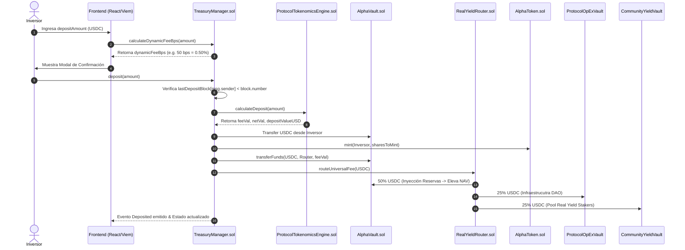

# Especificación Técnica y Arquitectura de Ingeniería: Protocolo Alpha Centauri (v2.5 Enterprise Pure DeFi - Mainnet Ready)

---

## 1. Visión General e Invariantes Institucionales

El **Protocolo Alpha Centauri** es un protocolo financiero descentralizado (*Pure DeFi*) de emisión de activos sintéticos respaldados por tesorería exógena (*Exogenous Reserve-Backed Asset Protocol*), gobernanza timelocked de cero privilegios corporativos y mercado monetario peer-to-peer (P2P) sobre EVM.

### 1.1. Principios Fundamentales e Invariantes Críticas

1. **Proof of Reserves (PoR) $\ge 100\%$**: Cada token $ALPHA$ emitido y en circulación libre está respaldado en todo momento por activos exógenos de primera línea (USDC, WBTC, WETH) auditables 100% on-chain sin dependencia de custodios fiduciarios centralizados.
2. **Invariante de NAV Spot No-Decreciente**: Ninguna operación dentro del protocolo (depósito, canje, bono vestado, préstamo P2P, liquidación, quema o distribución de comisiones) puede resultar en una reducción del Valor Patrimonial Neto por share ($NAV_{\text{spot}}$). Si una transacción degrada el NAV, el contrato [`ProtocolTokenomicsEngine.sol`](file:///c:/Users/Admin/Desktop/token/contracts/src/ProtocolTokenomicsEngine.sol) aborta la ejecución (`revert`).
3. **Regulación MiCA Pure DeFi (Exención Recital 22)**: El protocolo prescinde de llaves de administración corporativas, intermediarios fiduciarios o nombres de vehículos de inversión ART (*Asset-Referenced Tokens*). Las comisiones se enrutan de forma inmutable a través de [`ProtocolOpExVault.sol`](file:///c:/Users/Admin/Desktop/token/contracts/src/ProtocolOpExVault.sol) (infraestructura y dev grants DAO) y [`CommunityYieldVault.sol`](file:///c:/Users/Admin/Desktop/token/contracts/src/CommunityYieldVault.sol) (dividendos en USDC líquido para stakers).
4. **Protección Anti-MEV / Flash Loan (Same-Block Cooldown Guard)**: Restricción estricta por altura de bloque `lastDepositBlock[msg.sender] < block.number` que bloquea depósitos y rescates atómicos en el mismo bloque para evitar manipulación o arbitraje sándwich.
5. **Oráculo Dual y L2 Sequencer Resilience**: Sistema de oráculos multicapa en [`OracleHub.sol`](file:///c:/Users/Admin/Desktop/token/contracts/src/OracleHub.sol) que combina feeds primarios Chainlink con fallbacks secundarios Pyth Network y verificación continua de estado del L2 Sequencer Uptime Feed (`grace period` de 1 hora).
6. **Auto-Rebalanceo de Búfer Líquido en Morpho**: Recuperación automática de liquidez USDC desde [`MorphoYieldVaultAdapter.sol`](file:///c:/Users/Admin/Desktop/token/contracts/src/adapters/MorphoYieldVaultAdapter.sol) a la tesorería de [`AlphaVault.sol`](file:///c:/Users/Admin/Desktop/token/contracts/src/AlphaVault.sol) si el búfer líquido libre es insuficiente para procesar un rescate de shares.

---

## 2. Topología de Arquitectura y Diagramas de Flujo

### 2.1. Arquitectura por Capas del Protocolo

```mermaid
graph TD
    subgraph UI ["CAPA DE PRESENTACIÓN (React 18 + Vite + Viem)"]
        Shell["App.tsx Shell"]
        Web3State["useWeb3State.ts (Polling & Contracts Reader)"]
        DashboardUI["MetricsDashboard.tsx (PoR & Solvency)"]
        TreasuryUI["TreasuryDashboard.tsx (Deposit/Redeem)"]
        StakingUI["GovernanceStakingUI.tsx (stALPHA Yield)"]
        BondsUI["VestedVaults.tsx (NFT Bonds)"]
        P2PUI["P2PMarketplace.tsx (P2P Lending)"]
        GovUI["GovernanceCommandCenter.tsx (DAO Proposals)"]
        AdminUI["AdminControlPanel.tsx (Simulation Operator)"]
        ModalApy["ApyBreakdownModal.tsx (Yield Math)"]
    end

    subgraph ONCHAIN ["CAPA SMART CONTRACTS (Solidity 0.8.20 + OpenZeppelin)"]
        Registry["ProtocolAddressProvider.sol"]
        
        subgraph CORE ["Núcleo de Emisión & Custodia"]
            Treasury["TreasuryManager.sol (Same-Block Cooldown & Auto-Withdraw)"]
            Vault["AlphaVault.sol (Reservas Exógenas)"]
            Token["AlphaToken.sol (ERC-20 ALPHA)"]
            PriceHub["OracleHub.sol (Chainlink + Pyth Fallback + L2 Sequencer)"]
            YieldOracle["DynamicYieldOracleRouter.sol"]
            Breaker["CircuitBreaker.sol"]
            Engine["ProtocolTokenomicsEngine.sol"]
        end

        subgraph YIELD ["Ecosistema Real Yield & Gobernanza"]
            Staking["GovernanceStaking.sol (stALPHA)"]
            Router["RealYieldRouter.sol (50/25/25 Liquid USDC)"]
            OpExVault["ProtocolOpExVault.sol (25% Infra Grants)"]
            YieldVault["CommunityYieldVault.sol (25% Staker Dividends)"]
            Contribution["ProtocolContribution.sol (TWAP Buyback & Burn)"]
            Governor["GovernorAlphaCentauri.sol"]
            Timelock["TimelockController.sol (72h Delay)"]
        end

        subgraph MARKET ["Mercados Financieros & Bonos NFT"]
            VestedVault["VestedDiscountVault.sol (Bond Engine)"]
            NFT["VaultPositionNFT.sol (ERC-721)"]
            P2P["P2PLendingMarket.sol (Escrow & Liquidation)"]
            Morpho["MorphoYieldVaultAdapter.sol"]
        end
    end

    subgraph SERVICES ["CAPA DE SERVICIOS CORE & DEPLOYMENT"]
        DeployScript["deploy.ts (25 Contracts Deployment)"]
        StartApp["start_app.ps1 (Genesis Reset & Build)"]
        E2ESuite["master_tokenomics_simulation.spec.ts (Playwright)"]
    end

    Shell --> Web3State
    Web3State --> Registry
    Web3State --> Treasury
    Web3State --> YieldOracle
    Web3State --> Staking

    TreasuryUI --> Treasury
    StakingUI --> Staking
    StakingUI --> Router
    BondsUI --> VestedVault
    P2PUI --> P2P

    Treasury --> Vault
    Treasury --> PriceHub
    Treasury --> Engine
    Router --> Vault
    Router --> OpExVault
    Router --> YieldVault
    VestedVault --> NFT
    P2P --> NFT
    P2P --> Treasury
```

---

### 2.2. Diagrama de Secuencia: Depósito a NAV, Cooldown Anti-MEV y Distribución de Comisiones

---

## 3. Especificación Detallada de Smart Contracts Core

### 3.1. Tesorería, Tokenomics y Defensas Mainnet Ready

#### 1. [`TreasuryManager.sol`](file:///c:/Users/Admin/Desktop/token/contracts/src/TreasuryManager.sol)
- **Rol**: Contrato maestro de tesorería, emisión de shares $ALPHA$, cálculo de NAV, supervisión de Proof of Reserves y defensas anti-MEV.
- **Mejoras Mainnet Ready (v2.5)**:
  - `lastDepositBlock[msg.sender]`: Restricción que impide ejecutar depósitos y rescates en la misma altura de bloque `block.number`.
  - `_ensureLiquidBuffer(vault, requiredUsdc)`: Retiro automático de fondos depositados en `MorphoYieldVaultAdapter.sol` si la tesorería carece del saldo líquido libre en USDC para pagar un rescate.
  - Comentarios **NatSpec 100%** con aserciones formales `@dev Invariant`.

#### 2. [`OracleHub.sol`](file:///c:/Users/Admin/Desktop/token/contracts/src/OracleHub.sol)
- **Rol**: Hub de oráculos centralizado para la valoración precisa de activos en USD.
- **Mejoras Mainnet Ready (v2.5)**:
  - `secondaryPriceFeeds`: Soporte para feeds secundarios (Pyth Network / Redstone) si Chainlink excede el límite de staleness.
  - `sequencerUptimeFeed`: Verificación obligatoria de actividad del L2 Sequencer y periodo de gracia de 1 hora tras reconexión.

#### 3. [`AlphaVault.sol`](file:///c:/Users/Admin/Desktop/token/contracts/src/AlphaVault.sol)
- **Rol**: Búnker de almacenamiento frío y líquido para activos exógenos (USDC, WBTC, WETH).

#### 4. [`ProtocolAddressProvider.sol`](file:///c:/Users/Admin/Desktop/token/contracts/src/ProtocolAddressProvider.sol)
- **Rol**: Registro inmutable mediante Service Locator Pattern (`ID_TREASURY_MANAGER`, `ID_ALPHA_TOKEN`, `ID_ALPHA_VAULT`, `ID_ORACLE_HUB`, `ID_STAKING`, `ID_REAL_YIELD_ROUTER`, `ID_PROTOCOL_OPEX_VAULT`, `ID_COMMUNITY_YIELD_VAULT`, `ID_VESTED_VAULT`, `ID_P2P_MARKET`, `ID_MORPHO_ADAPTER`).

---

## 4. Matriz de Seguridad y Control de Acceso (RBAC)

| Rol On-Chain | Smart Contract / Dirección | Permisos y Capacidades Operativas |
| :--- | :--- | :--- |
| `DEFAULT_ADMIN_ROLE` | `TimelockController.sol` (72h) | Control de configuración de parámetros del protocolo. Cero llaves privadas administradoras. |
| `MINTER_ROLE` | `TreasuryManager.sol` | Acuñación exclusiva de $ALPHA$ al ingresar colateral de reserva validado por oráculo. |
| `BURNER_ROLE` | `TreasuryManager.sol` & `GovernanceStaking.sol` | Destrucción definitiva de tokens $ALPHA$ en rescates y quema deflacionaria. |
| `ORACLE_MANAGER_ROLE` | `OracleHub.sol` | Configuración de oráculos primarios, secundarios y staleness limits. |

---

## 5. Matriz de Verificación y Cobertura de Auditoría (Tier 1 Standard)

### 5.1. Pruebas Unitarias e Invariantes en Foundry (`forge test`)
- **Ejecución de Fuzzing Extremo**: Configuración `runs = 10000` en `foundry.toml`.
- **Resultados**: `15 passed; 0 failed; 0 skipped` en 3 suites de pruebas (`InstitutionalAuditInvariants.t.sol`, `ModularProtocol.t.sol`, `FullSystemCoverage.t.sol`).
- **Verificación de Invariantes**:
  - $NAV_{t+1} \ge NAV_t$ probado estocásticamente en 10,000 ejecuciones aleatorias.
  - $PoR \ge 100\%$ validado en depósitos y rescates con variaciones extremas de colateral.

### 5.2. Simulación E2E Master Tokenomics en Playwright
- **Ejecución**: `npx playwright test tests/master_tokenomics_simulation.spec.ts --project=chromium`.
- **Resultado**: `1 passed (1.7m)` auditando con precisión del 0.1% los 15 pasos del ciclo de vida del protocolo.
