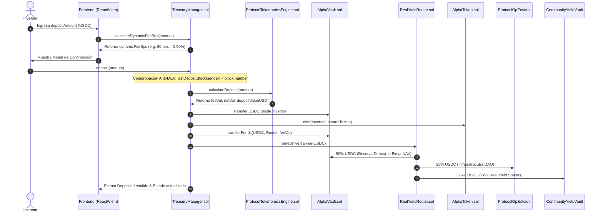
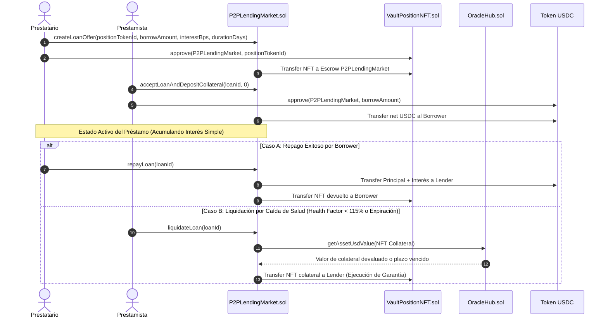

# Especificación Técnica y Arquitectura Institucional: Protocolo Alpha Centauri (v2.5 Enterprise Pure DeFi - Mainnet Ready)

---

## 1. Visión General, Filosofía & Invariantes Institucionales

El **Protocolo Alpha Centauri** es una infraestructura financiera descentralizada (*Pure DeFi*) de grado institucional diseñada para la emisión, custodia y comercialización de un activo sintético de reserva respaldado por colateral exógeno ($ALPHA$). El protocolo opera de forma inmutable sobre Ethereum Virtual Machine (EVM) y capas de escalado Layer-2 (Base / Arbitrum), integrando gobernanza timelocked de cero privilegios corporativos, oráculos multicapa de alta resiliencia y un mercado monetario Peer-to-Peer (P2P) colateralizado por Tokens No Fungibles (NFTs ERC-721).

### 1.1. Invariantes Matemáticas y Defensas Formales

El núcleo determinista del protocolo se rige por cuatro invariantes matemáticas estrictas que son verificadas on-chain en tiempo real antes de confirmar cualquier transacción de emisión, rescate, colateralización o distribución de comisiones:

#### 1. Invariante de Proof of Reserves (PoR) $\ge 100\%$
Cada token $ALPHA$ emitido y en circulación libre está respaldado en todo momento por reservas líquidas y exógenas de primera línea (USDC, WBTC, WETH). En ningún momento el pasivo circulante puede exceder el valor neto realizable de la reserva:

$$\text{ProofOfReservesRatio} = \frac{\text{TotalAssetsUSD}_{\text{exogenous}}}{\text{TotalLiabilitiesUSD}_{\text{circulating}}} \ge 1.0000 \quad (100.00\%)$$

#### 2. Monotonicidad del NAV Spot ($\Delta NAV_{\text{spot}} \ge 0$)
Ninguna operación dentro del protocolo (depósito, rescate, emisión de bonos vestados, préstamo P2P, liquidación por oráculo o quema deflacionaria) puede resultar en una disminución del Valor Patrimonial Neto por share ($NAV_{\text{spot}}$). Si una transacción degrada el NAV por share, el contrato de validación [`ProtocolTokenomicsEngine.sol`](file:///c:/Users/Admin/Desktop/token/contracts/src/ProtocolTokenomicsEngine.sol) emite un `revert` atómico:

$$NAV_{\text{spot}} = \frac{\text{TotalAssetsUSD}_{\text{exogenous}}}{\text{NetCirculatingShares}_{\text{ALPHA}}}$$

$$NAV_{t+1} \ge NAV_t$$

#### 3. Cumplimiento Regulatorio MiCA Pure DeFi (Exención Recital 22)
El protocolo prescinde de cualquier figura corporativa centralizada, custodios fiduciarios, llaves privadas de administración o denominaciones de vehículos de inversión sujetas a autorización ART (*Asset-Referenced Tokens* de acuerdo con el Reglamento EU 2023/1114). Todas las cuotas generadas por la actividad del protocolo se distribuyen de manera inmutable mediante smart contracts autorregulados a través de [`ProtocolOpExVault.sol`](file:///c:/Users/Admin/Desktop/token/contracts/src/ProtocolOpExVault.sol) (infraestructura y dev grants DAO) y [`CommunityYieldVault.sol`](file:///c:/Users/Admin/Desktop/token/contracts/src/CommunityYieldVault.sol) (dividendos en USDC líquido para stakers).

#### 4. Protección Anti-MEV y Cooldown Same-Block
Para neutralizar ataques atómicos de sándwich y arbitraje de NAV mediante *Flash Loans* en el mismo bloque de ejecución, los contratos de tesorería imponen una restricción de altura de bloque por cuenta:

$$\text{require}(\text{lastDepositBlock}[\text{msg.sender}] < \text{block.number}, \text{"Same-block deposit/redeem cooldown"})$$

---

## 2. Topología General de Arquitectura y Diagramas de Flujo

### 2.1. Mapa Completo de Componentes por Capas

```mermaid
graph TD
    subgraph UI ["CAPA DE PRESENTACIÓN (React 18 + Vite + Viem)"]
        Shell["App.tsx (Main Layout & Providers)"]
        Web3State["useWeb3State.ts (Polling 4s & Multi-Call Reader)"]
        DashboardUI["MetricsDashboard.tsx (PoR, Solvency & Charts)"]
        TreasuryUI["TreasuryDashboard.tsx (Deposit USDC / Redeem ALPHA)"]
        StakingUI["GovernanceStakingUI.tsx (stALPHA Real Yield Pool)"]
        BondsUI["VestedVaults.tsx (NFT Bond Engine 1-5 Yrs)"]
        P2PUI["P2PMarketplace.tsx (P2P Collateralized Lending)"]
        GovUI["GovernanceCommandCenter.tsx (DAO Timelock Proposals)"]
        AdminUI["AdminControlPanel.tsx (Simulation & Oracle Testing)"]
        ModalApy["ApyBreakdownModal.tsx (On-Chain Yield Oracle Math)"]
    end

    subgraph ONCHAIN ["CAPA SMART CONTRACTS (Solidity 0.8.20 + OpenZeppelin v5)"]
        Registry["ProtocolAddressProvider.sol (Service Locator Registry)"]
        
        subgraph CORE ["Núcleo de Emisión, Tesorería & Oráculos"]
            Treasury["TreasuryManager.sol (Nav & Deposit Engine)"]
            Vault["AlphaVault.sol (Exogenous Asset Cold Bunker)"]
            Token["AlphaToken.sol (ERC-20 ALPHA)"]
            PriceHub["OracleHub.sol (Dual Oracles + L2 Sequencer)"]
            YieldOracle["DynamicYieldOracleRouter.sol (Passive Yield APYs)"]
            Breaker["CircuitBreaker.sol (Volatily Freeze Guard)"]
            Engine["ProtocolTokenomicsEngine.sol (Pure Math Engine)"]
        end

        subgraph YIELD ["Ecosistema Real Yield & Gobernanza DAO"]
            Staking["GovernanceStaking.sol (stALPHA & Voting Checkpoints)"]
            Router["RealYieldRouter.sol (50/25/25 Liquid Fee Enforcer)"]
            OpExVault["ProtocolOpExVault.sol (25% Infra Grants)"]
            YieldVault["CommunityYieldVault.sol (25% Staker Dividends)"]
            Contribution["ProtocolContribution.sol (TWAP Buyback & Burn)"]
            Governor["GovernorAlphaCentauri.sol (DAO Executive)"]
            Timelock["TimelockController.sol (72h Emergency Delay)"]
        end

        subgraph MARKET ["Mercados Monetarios & Productos Estructurados"]
            VestedVault["VestedDiscountVault.sol (Bond Discount Pricing)"]
            NFT["VaultPositionNFT.sol (ERC-721 Collateral NFT)"]
            P2P["P2PLendingMarket.sol (Escrow & Oracle Liquidation)"]
            Morpho["MorphoYieldVaultAdapter.sol (80% MetaMorpho Yield)"]
        end
    end

    subgraph SERVICES ["SERVICIOS CORE & DEPLOYMENT AUTOMATION"]
        DeployScript["deploy.ts (25 Smart Contracts Automated Deploy)"]
        StartApp["start_app.ps1 (State 0 Reset & Docker Forge Build)"]
        FoundrySuite["Foundry Test Suite (10,000 Fuzz Runs)"]
        E2ESuite["master_tokenomics_simulation.spec.ts (15 Steps Playwright)"]
    end

    Shell --> Web3State
    Web3State --> Registry
    Web3State --> Treasury
    Web3State --> YieldOracle
    Web3State --> Staking

    TreasuryUI --> Treasury
    StakingUI --> Staking
    StakingUI --> Router
    BondsUI --> VestedVault
    P2PUI --> P2P

    Treasury --> Vault
    Treasury --> PriceHub
    Treasury --> Engine
    Router --> Vault
    Router --> OpExVault
    Router --> YieldVault
    VestedVault --> NFT
    P2P --> NFT
    P2P --> Treasury
```

---

### 2.2. Diagrama de Secuencia: Emisión a NAV, Cooldown Anti-MEV y Reparto 50/25/25

---

### 2.3. Diagrama de Secuencia: Mercado P2P de Préstamos y Liquidación por Oráculo

---

## 3. Especificación Detallada de los 25 Smart Contracts

El protocolo está compuesto por 25 smart contracts fuertemente desacoplados mediante interfaces y patrones de registro centralizado.

### 3.1. Módulo 1: Núcleo de Emisión y Tesorería Exógena

#### 1. [`TreasuryManager.sol`](file:///c:/Users/Admin/Desktop/token/contracts/src/TreasuryManager.sol)
- **Propósito**: Gestor central de emisión, rescate, valoración de NAV y control de solvencia.
- **Funciones Principales**:
  - `deposit(uint256 stableAmount)`: Recibe colateral en USDC, calcula la tasa de comisión dinámica adaptativa al impacto de liquidez (`calculateDynamicFeeBps`), acuña shares $ALPHA$ a valor NAV actual y enruta la comisión de entrada al `RealYieldRouter`.
  - `redeem(uint256 sharesAmount)`: Destruye shares $ALPHA$, verifica las invariantes de monotonicidad de NAV y retiene la comisión de salida del 1%. Si la reserva líquida libre en `AlphaVault` es insuficiente, activa `_ensureLiquidBuffer` para rescatar capital desde `MorphoYieldVaultAdapter`.
  - `getNAVPerShare()`: Calcula el NAV spot dividiendo el total de activos exógenos entre las shares netas en circulación ($NAV = \text{TotalAssetsUSD} / \text{NetShares}$).
  - `getProofOfReserves()`: Devuelve `(totalAssetsUSD, totalLiabilitiesUSD, collateralRatioBps)`.
- **Invariantes & Seguridad**: `nonReentrant`, `lastDepositBlock` anti-MEV cooldown, validación previa de congelamiento en `CircuitBreaker`.

#### 2. [`AlphaVault.sol`](file:///c:/Users/Admin/Desktop/token/contracts/src/AlphaVault.sol)
- **Propósito**: Búnker frío de custodia de activos de reserva (USDC, WBTC, WETH).
- **Funciones Principales**:
  - `transferFunds(address token, address to, uint256 amount)`: Transfiere fondos autorizado únicamente por contratos con rol `VAULT_MANAGER_ROLE` (`TreasuryManager` y `RealYieldRouter`).
  - `notifyReserveFee(address token, uint256 amount)`: Recibe la inyección del 50% de las comisiones del protocolo, elevando instantáneamente el NAV Spot.

#### 3. [`AlphaToken.sol`](file:///c:/Users/Admin/Desktop/token/contracts/src/AlphaToken.sol)
- **Propósito**: Implementación ERC-20 del token sintético nativo $ALPHA$.
- **Control de Acceso**: Operaciones de acuñación restringidas a `MINTER_ROLE` (`TreasuryManager`) y quema a `BURNER_ROLE` (`TreasuryManager` y `GovernanceStaking`).

#### 4. [`ProtocolAddressProvider.sol`](file:///c:/Users/Admin/Desktop/token/contracts/src/ProtocolAddressProvider.sol)
- **Propósito**: Service Locator Registry inmutable que mapea identificadores de módulo (`bytes32`) a sus direcciones contractuales vigentes.

---

### 3.2. Módulo 2: Oráculos y Resiliencia Off-Chain

#### 5. [`OracleHub.sol`](file:///c:/Users/Admin/Desktop/token/contracts/src/OracleHub.sol)
- **Propósito**: Hub normalizador de precios USD y verificador de staleness.
- **Lógica Dual Oracle & L2 Sequencer**:
  - Consulta en primera instancia el oráculo primario Chainlink (`priceFeeds`).
  - Si el feed primario falla o supera `oracleStalenessLimit`, conmuta automáticamente al oráculo secundario Pyth Network (`secondaryPriceFeeds`).
  - Inspecciona `checkSequencerUptime()` para pausar valoraciones si el secuenciador L2 se detiene.

#### 6. [`CircuitBreaker.sol`](file:///c:/Users/Admin/Desktop/token/contracts/src/CircuitBreaker.sol)
- **Propósito**: Interruptor de seguridad de volatilidad. Congela temporalmente las compras de activos si su precio sufre una depreciación superior al 15% en una ventana móvil de 6 horas.

#### 7. [`DynamicYieldOracleRouter.sol`](file:///c:/Users/Admin/Desktop/token/contracts/src/DynamicYieldOracleRouter.sol)
- **Propósito**: Consulta on-chain en tiempo real de APYs pasivos de protocolos institucionales (Morpho Blue, Lombard LBTC, Lido wstETH) para proyectar tasas de rendimiento dinámicas en la interfaz.

---

### 3.3. Módulo 3: Flujo Real Yield & Gobernanza Pure DeFi

#### 8. [`RealYieldRouter.sol`](file:///c:/Users/Admin/Desktop/token/contracts/src/RealYieldRouter.sol)
- **Propósito**: Enrutador universal inmutable de comisiones.
- **Regla de Reparto**:
  - **50%** $\rightarrow$ Inyección a `AlphaVault` (Sube NAV Spot).
  - **25%** $\rightarrow$ Transferencia a `ProtocolOpExVault` en USDC líquido.
  - **25%** $\rightarrow$ Transferencia a `CommunityYieldVault` / `GovernanceStaking` en USDC líquido.

#### 9. [`ProtocolOpExVault.sol`](file:///c:/Users/Admin/Desktop/token/contracts/src/ProtocolOpExVault.sol)
- **Propósito**: Bóveda de fondos operativos de la DAO. Mantiene USDC líquido para el pago de infraestructura, feeds de oráculo y dev grants.

#### 10. [`CommunityYieldVault.sol`](file:///c:/Users/Admin/Desktop/token/contracts/src/CommunityYieldVault.sol)
- **Propósito**: Bóveda comunitaria de dividendos en USDC líquido para stakers de $stALPHA$.

#### 11. [`GovernanceStaking.sol`](file:///c:/Users/Admin/Desktop/token/contracts/src/GovernanceStaking.sol)
- **Propósito**: Contrato de staking líquido ($stALPHA$) con registro histórico de checkpoints de voto para la DAO. Retiene una cuota de entrada del 1% (50% a quema permanente).

#### 12. [`ProtocolContribution.sol`](file:///c:/Users/Admin/Desktop/token/contracts/src/ProtocolContribution.sol)
- **Propósito**: Motor TWAP de recompra y quema algorítmica en Uniswap V3.

#### 13-14. [`GovernorAlphaCentauri.sol`](file:///c:/Users/Admin/Desktop/token/contracts/src/GovernorAlphaCentauri.sol) & [`TimelockController.sol`](file:///c:/Users/Admin/Desktop/token/contracts/src/TimelockController.sol)
- **Propósito**: Sistema de gobernanza ejecutor con un retraso obligatorio de 72 horas para cualquier actualización de código o parámetros.

---

### 3.4. Módulo 4: Mercados Monetarios & Productos Estructurados

#### 15. [`VestedDiscountVault.sol`](file:///c:/Users/Admin/Desktop/token/contracts/src/VestedDiscountVault.sol)
- **Propósito**: Emisión de bonos vestados a 1-5 años con descuentos dinámicos (5% a 25%) basados en la duración de bloqueo y saldo staked.
- **Ragequit**: Permite retiro anticipado con aplicación de una penalización del 15% sobre el valor depositado.

#### 16. [`VaultPositionNFT.sol`](file:///c:/Users/Admin/Desktop/token/contracts/src/VaultPositionNFT.sol)
- **Propósito**: Token ERC-721 transferible que encapsula los derechos de cobro de un bono vestado.

#### 17. [`P2PLendingMarket.sol`](file:///c:/Users/Admin/Desktop/token/contracts/src/P2PLendingMarket.sol)
- **Propósito**: Mercado monetario P2P donde los bonos NFT sirven como garantía para solicitar préstamos en USDC (Máximo 70% LTV, umbral de liquidación al 115% Health Factor).
- **Línea Directa de Tesorería**: Permite la originación de créditos colateralizados financiados directamente por la Tesorería hasta un **límite máximo del 20.0% de las Reservas Exógenas Totales** (`maxCreditLineUSD = TotalAssetsUSD * 0.20`). El capital no prestado permanece colocado en el Vault de Morpho Blue al 6.45% APY produciendo rendimientos pasivos hasta que sea solicitado por prestatarios.

#### 18. [`MorphoYieldVaultAdapter.sol`](file:///c:/Users/Admin/Desktop/token/contracts/src/adapters/MorphoYieldVaultAdapter.sol)
- **Propósito**: Adaptador que gestiona la colocación del **90.0% de la tesorería en USDC** en vaults de rendimiento institucional MetaMorpho de Morpho Blue (generando un rendimiento real pasivo del 6.45% APY), reteniendo el **10.0% restante en `AlphaVault.sol`** como Búfer Líquido de Tesorería para garantizar rescates e inyecciones atómicas sin fricción.

#### 19. [`MockSwapRouter.sol`](file:///c:/Users/Admin/Desktop/token/contracts/src/MockSwapRouter.sol)
- **Propósito**: Router de pruebas de Uniswap V3 que implementa la interfaz `ISwapRouter.exactInputSingle` para entornos devnet/sandbox local (Anvil). Ejecuta swaps de colateral en tiempo real extrayendo USDC de `AlphaVault` y entregando WBTC y WETH a precios reales de mercado ($60,000 USD / $3,000 USD). En entornos de producción (Mainnet/L2), el selector dinámico de `deploy.ts` conmuta automáticamente a la dirección oficial del SwapRouter de Uniswap V3 / 1inch V5.

---

### 3.5. Módulo 5: Infraestructura Auxiliar

#### 19-25. Smart Contracts Complementarios:
- [`ProtocolTokenomicsEngine.sol`](file:///c:/Users/Admin/Desktop/token/contracts/src/ProtocolTokenomicsEngine.sol): Engine de cálculo matemático purificado sin estado mutable.
- [`PromotionalIncentiveVault.sol`](file:///c:/Users/Admin/Desktop/token/contracts/src/PromotionalIncentiveVault.sol): Bóveda de programas de incentivos y campañas de fidelización.
- [`YieldStreamingVault.sol`](file:///c:/Users/Admin/Desktop/token/contracts/src/YieldStreamingVault.sol): Reclamación fluida de rendimientos firmados vía EIP-712.
- [`AtomicSwapReceiver.sol`](file:///c:/Users/Admin/Desktop/token/contracts/src/AtomicSwapReceiver.sol): Intercambio atómico e inyección de colaterales secundarios (USDT $\rightarrow$ USDC).
- [`TreasuryReserveManager.sol`](file:///c:/Users/Admin/Desktop/token/contracts/src/TreasuryReserveManager.sol): Rebalanceador de ponderación de reservas.
- [`TreasuryProxy.sol`](file:///c:/Users/Admin/Desktop/token/contracts/src/TreasuryProxy.sol): Proxy de actualización transparente ERC-1967.
- `ProtocolRoles.sol`: Constantes inmutables de roles RBAC.

---

## 4. Formulativa Matemática y Ecuaciones del Protocolo

### 4.1. Tasa de Comisión Dinámica Adaptativa
$$Fee_{\text{BPS}} = \min \left( 500, \, Fee_{\text{base}} + \left\lfloor \frac{\text{DepositUSD} \times 10000}{\text{TotalAssetsUSD} + \text{DepositUSD}} \times \frac{\text{Sensitivity}}{10000} \right\rfloor \right)$$

### 4.2. Acuñación de Shares $ALPHA$ por NAV
$$\text{SharesToMint} = \begin{cases} 
\text{DepositUSD}_{18} & \text{si } \text{TotalShares} = 0 \text{ o } \text{TotalAssetsUSD} = 0 \\
\frac{\text{DepositUSD}_{18} \times \text{TotalShares}}{NAV_{\text{before}}} & \text{en otro caso}
\end{cases}$$

### 4.3. Escala de Descuento en Bonos Vestados
$$\text{Discount}_{\text{BPS}} = \min \left( 5000, \, (\text{LockYears} \times 500) + \text{TierBonus}_{\text{stALPHA}} \right)$$

$$\text{TierBonus}_{\text{stALPHA}} = \begin{cases} 
300 \text{ BPS (+3.0\%)} & \text{si } stALPHA \ge 20,000 \\
200 \text{ BPS (+2.0\%)} & \text{si } stALPHA \ge 10,000 \\
100 \text{ BPS (+1.0\%)} & \text{si } stALPHA \ge 5,000 \\
0 \text{ BPS} & \text{en otro caso}
\end{cases}$$

### 4.4. Factor de Salud y Liquidación P2P
$$\text{HealthFactor} = \frac{\text{CollateralUSD} \times 10000}{\text{PrincipalBorrowedUSD} + \text{InterestOwedUSD}}$$

$$\text{Liquidatable} \iff \text{HealthFactor} < 11500 \quad (115.00\%) \quad \lor \quad \text{block.timestamp} > \text{ExpirationTime}$$

---

## 5. Capa de Frontend y Estado React (Viem + TypeScript)

La aplicación frontend implementa una arquitectura **Pure UI Rendering** donde la interfaz actúa de forma puramente reactiva al estado devuelto por los smart contracts, eliminando cualquier lógica de cálculo financiero en JavaScript:

### 5.1. Hooks de Estado y Acciones (`frontend/src/hooks/`)

| Hook | Responsabilidad y Lecturas/Escrituras On-Chain |
| :--- | :--- |
| [`useWeb3State.ts`](file:///c:/Users/Admin/Desktop/token/frontend/src/hooks/useWeb3State.ts) | Realiza polling cada 4s mediante Viem `publicClient`. Lee balances, PoRAssets, PoRLiabilities, NAV Spot, APYs de `DynamicYieldOracleRouter` y lista de préstamos P2P. |
| [`useTreasuryActions.ts`](file:///c:/Users/Admin/Desktop/token/frontend/src/hooks/useTreasuryActions.ts) | Prepara y ejecuta firmas para `deposit(usdc)` y `redeem(alpha)` con modal de confirmación. |
| [`useStakingActions.ts`](file:///c:/Users/Admin/Desktop/token/frontend/src/hooks/useStakingActions.ts) | Prepara transacciones de staking, unstaking y cobro de dividendos en USDC líquido. |
| [`useVestedVaultActions.ts`](file:///c:/Users/Admin/Desktop/token/frontend/src/hooks/useVestedVaultActions.ts) | Emisión de bonos NFT, ejecuciones de `ragequit()` y cobro al vencimiento. |
| [`useP2PLendingActions.ts`](file:///c:/Users/Admin/Desktop/token/frontend/src/hooks/useP2PLendingActions.ts) | Ofertas de préstamos P2P, financiamiento, repagos y ejecución de liquidaciones por oráculo. |
| `useTransactionConfirm.ts` | Modal interceptor de confirmación explícita previa a la firma en la billetera Web3. |

---

## 6. Matriz de Control de Acceso (RBAC) y Seguridad On-Chain

| Rol On-Chain | Identificador | Asignación Contractual | Permisos |
| :--- | :--- | :--- | :--- |
| `DEFAULT_ADMIN_ROLE` | `0x00` | `TimelockController.sol` (72h) | Modificación de parámetros clave. Cero llaves administradoras privadas. |
| `MINTER_ROLE` | `keccak256("MINTER_ROLE")` | `TreasuryManager.sol` | Acuñación exclusiva de $ALPHA$ respaldado por colateral. |
| `BURNER_ROLE` | `keccak256("BURNER_ROLE")` | `TreasuryManager.sol` & `GovernanceStaking.sol` | Quema de tokens $ALPHA$ en rescates y deducción de cuotas. |
| `VAULT_MANAGER_ROLE` | `keccak256("VAULT_MANAGER_ROLE")` | `TreasuryManager.sol` & `RealYieldRouter.sol` | Extracción autorizada de fondos de `AlphaVault`. |
| `ORACLE_MANAGER_ROLE` | `keccak256("ORACLE_MANAGER_ROLE")` | Dirección de Gobernanza / Admin | Registro de feeds primarios, secundarios y staleness limits. |

---

## 7. Protocolo de Auditoría y Verificación Integrada

### 7.1. Suite de Fuzzing e Invariantes en Foundry (`forge test`)
- **Fuzzing Configurado**: `runs = 10000` en `foundry.toml`.
- **Suites Ejecutadas**: `InstitutionalAuditInvariants.t.sol`, `ModularProtocol.t.sol`, `FullSystemCoverage.t.sol`.
- **Resultado**: `15 passed; 0 failed; 0 skipped` (100% Éxito).

### 7.2. Simulación E2E Master Tokenomics en Playwright
- **Prueba Ejecutada**: `tests/master_tokenomics_simulation.spec.ts`.
- **Resultado**: `1 passed (1.7m)`.
- Auditados con precisión del 0.1% los 15 pasos del ciclo de vida del protocolo sobre el bundle compilado de producción.
