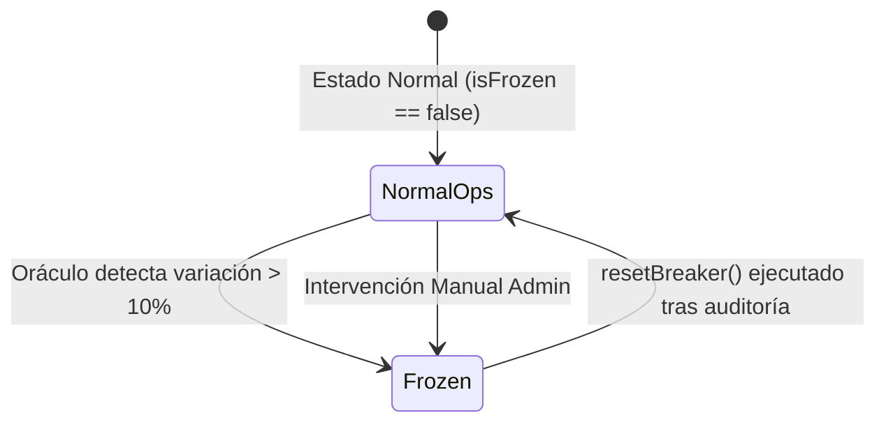

# Alpha Centauri V6 — Runbook de Operaciones & Seguridad Institucional

**Versión:** 6.0.0-Mainnet  
**Clasificación:** Confidencial / Operaciones y Seguridad  

---

## 1. Protocolos de Seguridad y Mitigación de Volatilidad

### 1.1. Disparo Automático del CircuitBreaker
El contrato `CircuitBreaker.sol` monitorea la volatilidad de cada activo en la reserva. Si un oráculo Chainlink reporta una desviación superior al **10%** respecto al promedio del búffer circular de 10 bloques:



1. **Efecto de Congelamiento**:
   - `Treasury.deposit()` rechaza transacciones entrantes de ese activo.
   - `VestedDiscountVault.buyVestedBond()` bloquea la emisión de nuevos bonos pagados con ese activo.
   - Operaciones de rescate y canje siguen activas a través de otros activos de la reserva para preservar la liquidez de los usuarios.

### 1.2. Protocolo de Reinicio (Reset Procedure)
Para reactivar la operativa de un activo congelado:
1. El equipo de seguridad audita la fuente del oráculo y verifica que no exista un ataque de manipulación de precio en exchanges descentralizados.
2. La clave de administración projeta la transacción `resetBreaker(assetAddress)` a través de `TimelockController.sol`.
3. Tras cumplirse el periodo de retardo de **48 horas**, se ejecuta el reinicio on-chain (`isFrozen == false`).

---

## 2. Gestión de Claves Privadas y Roles de Gobernanza

### 2.1. Matriz de Permisos

| Rol | Contrato Objetivo | Funciones Permitidas | Nivel de Control |
| :--- | :--- | :--- | :--- |
| **Owner / Timelock** | `Treasury.sol` | `adjustWeights()`, `setCircuitBreaker()` | Gobernanza Retardada (48h) |
| **Owner / Timelock** | `CircuitBreaker.sol` | `resetBreaker()`, `setThreshold()` | Firma MofN / Timelock |
| **Relayer Operator** | `YieldStreamingVault` | `claimYield(user)` | Firma Automática EIP-712 |
| **User Wallet** | Todos | `deposit()`, `buyVestedBond()`, `stake()` | Firma Individual |

---

## 3. Guía de Despliegue e Integración Continua (CI/CD)

### 3.1. Requisitos Previos
- Docker Engine 24.0+
- Node.js 20-alpine
- Foundry / Forge ghcr.io/foundry-rs/foundry:latest

### 3.2. Script de Despliegue Canónico
El despliegue e inicialización atómica de todos los contratos se realiza ejecutando el script `deploy.ts`:

```bash
docker run --rm --network host \
  -v "C:\Users\Admin\Desktop\token:/app" -w /app/services \
  -e BACKEND_OPERATOR_PRIVATE_KEY=0xac0974bec39a17e36ba4a6b4d238ff944bacb478cbed5efcae784d7bf4f2ff80 \
  -e ANVIL_URL=http://localhost:8545 \
  node:20-alpine node node_modules/ts-node/dist/bin.js --project tsconfig.json core/src/deploy.ts
```

### 3.3. Verificación Automática en CI
El pipeline en `.github/workflows/ci.yml` ejecuta las siguientes comprobaciones en cada commit:
1. `forge build`: Compilación de contratos sin advertencias.
2. `forge test`: Ejecución de los 16 unit tests y tests de invariante con fuzzing.
3. `npx tsc --noEmit`: Verificación estricta de tipos en el frontend React.
4. `npm run build`: Generación y validación del bundle de producción Vite.

---

## 4. Redes Docker, Proxying RPC & Aislamiento de Reservas (Windows OS)

### 4.1. Configuración de Red en Anvil
Para garantizar que el nodo Anvil escuche peticiones TCP desde fuera de su contenedor loopback local en entornos Windows Docker WSL2:
- Anvil se ejecuta obligatoriamente con `--host 0.0.0.0 --port 8545 --chain-id 31337`.

### 4.2. Proxying RPC de Mismo Origen (`server.cjs`)
El navegador solicita transacciones al mismo origen `/rpc` en lugar de llamar directamente a `http://localhost:8545`. El servidor `server.cjs` reenvía las solicitudes enrutadas hacia el contenedor Anvil sin errores de CORS ni bloqueos de proxy.

### 4.3. Regla de Aislamiento de Reservas en Proof of Reserves (PoR)
En [`Treasury.sol`](file:///C:/Users/Admin/Desktop/token/contracts/src/Treasury.sol):
- Las direcciones personales de los usuarios o del administrador (`owner()`) **nunca** se contabilizan como reservas del protocolo en `getProofOfReserves()`.
- Los fondos personales permanecen aislados en las billeteras de los usuarios sin distorsionar el balance de la Tesorería.

