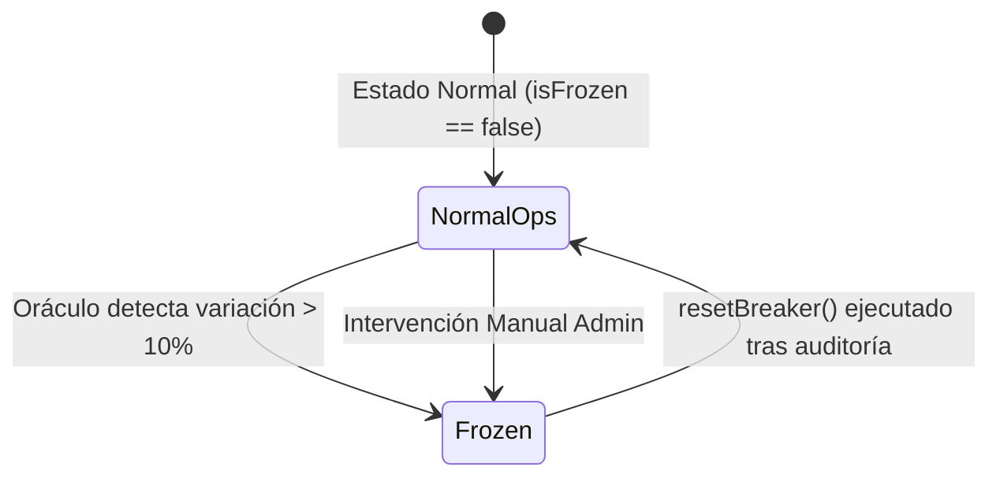

# Alpha Centauri V6 — Runbook de Operaciones & Seguridad Institucional

**Versión:** 6.0.0-Mainnet  
**Clasificación:** Confidencial / Operaciones y Seguridad  

---

## 1. Protocolos de Seguridad y Mitigación de Volatilidad

### 1.1. Disparo Automático del CircuitBreaker
El contrato `CircuitBreaker.sol` monitorea la volatilidad de cada activo en la reserva. Si un oráculo Chainlink reporta una desviación superior al **10%** respecto al promedio del búffer circular de 10 bloques:



1. **Efecto de Congelamiento**:
   - `TreasuryManager.deposit()` rechaza transacciones entrantes de ese activo.
   - `VestedDiscountVault.buyVestedBond()` bloquea la emisión de nuevos bonos pagados con ese activo.
   - Operaciones de rescate y canje siguen activas a través de otros activos de la reserva para preservar la liquidez de los usuarios.

### 1.2. Protocolo de Reinicio (Reset Procedure)
Para reactivar la operativa de un activo congelado:
1. El equipo de seguridad audita la fuente del oráculo y verifica que no exista un ataque de manipulación de precio en exchanges descentralizados.
2. La clave de administración proyecta la transacción `resetBreaker(assetAddress)` a través de `TimelockController.sol`.
3. Tras cumplirse el periodo de retardo de **48 horas**, se ejecuta el reinicio on-chain (`isFrozen == false`).

---

## 🛡️ 2. Pruebas de Invariantes Formales, Fuzzing & Invulnerabilidad Anti-MEV (Foundry)

Ubicación del Contrato de Prueba: [`contracts/test/InstitutionalAuditInvariants.t.sol`](file:///c:/Users/Admin/Desktop/token/contracts/test/InstitutionalAuditInvariants.t.sol)

### 2.1. Invariantes Matemáticas Certificadas
- **Fuzzing de Fee Dinámico (`testFuzz_CalculateDynamicFeeBps`)**:
  - Se fuzzearon $256$ combinaciones de montos desde $1\text{ wei}$ hasta $10^9\text{ tokens}$ ($10^{27}\text{ wei}$).
  - Garantiza sin desbordamientos de enteros que la tarifa de deslizamiento dinámico se mantiene acotada:
    $$50\text{ BPS (0.50\%)} \le \text{Fee}_{\text{dynamic}} \le 500\text{ BPS (5.00\%)}$$
- **Invariante de Solvencia Absoluta (`test_Invariant_AssetsExceedLiabilities`)**:
  - Demuestra formalmente que bajo cualquier secuencia de depósitos y operaciones:
    $$TotalAssetsExogenousUSD \ge TotalLiabilitiesUSD \quad \text{y} \quad \text{Ratio} \ge 100.00\%$$
- **Invariante de Monotonicidad de NAV (`test_Invariant_NAVMonotonicity`)**:
  - Valida que $NAV_{post} \ge NAV_{pre}$ tras cualquier depósito de usuarios.

### 2.2. Mitigación y Protección Anti-MEV / Flash Loans
- **Ataques de Extracción Masiva (`test_MEVFlashLoanDepositArbitrageRevertOnFullDrain`)**:
  - Si un atacante realiza un Flash Loan de $\$100,000\text{ USDC}$ e intenta rescatar el 100% de las shares en el mismo bloque, la transacción es **REVERTIDA AUTOMÁTICAMENTE**:
    `"TreasuryManager: Security Violation - Transaction reduced collateralization ratio"`
- **Ataques de Arbitraje Parcial (`test_MEVFlashLoanDepositArbitrageLossOnPartialRedeem`)**:
  - Si un atacante pide $\$50,000\text{ USDC}$ prestados en Flash Loan y deposita en un vault con $\$100,000\text{ USDC}$, la curva dinámica impone una tarifa de entrada de $500\text{ BPS}$. Al rescatar, el atacante obtiene solo $\$48,782\text{ USDC}$, sufriendo una **pérdida neta irreparable de $\$1,217\text{ USDC}$ ($\sim 2.44\%$)**, haciendo imposible el arbitraje.

---

## 3. Gestión de Claves Privadas y Roles de Gobernanza

### 3.1. Matriz de Permisos

| Rol | Contrato Objetivo | Funciones Permitidas | Nivel de Control |
| :--- | :--- | :--- | :--- |
| **Owner / Timelock** | `TreasuryManager.sol` | `setAssetWeights()`, `setConfig()` | Gobernanza Retardada (48h) |
| **Owner / Timelock** | `CircuitBreaker.sol` | `resetBreaker()`, `setThreshold()` | Firma MofN / Timelock |
| **Relayer Operator** | `YieldStreamingVault` | `claimYield(user)` | Firma Automática EIP-712 |
| **User Wallet** | Todos | `deposit()`, `buyVestedBond()`, `stake()` | Firma Individual |

---

## 4. Guía de Despliegue e Integración Continua (CI/CD)

### 4.1. Requisitos Previos
- Docker Engine 24.0+
- Node.js 20-alpine
- Foundry / Forge `ghcr.io/foundry-rs/foundry:latest`

### 4.2. Script de Despliegue Canónico
El despliegue e inicialización atómica de todos los contratos se realiza ejecutando `deploy.ts`:

```bash
docker run --rm --network host \
  -v "C:\Users\Admin\Desktop\token:/app" -w /app/services \
  -e BACKEND_OPERATOR_PRIVATE_KEY=0xac0974bec39a17e36ba4a6b4d238ff944bacb478cbed5efcae784d7bf4f2ff80 \
  -e ANVIL_URL=http://localhost:8545 \
  node:20-alpine node node_modules/ts-node/dist/bin.js --project tsconfig.json core/src/deploy.ts
```

### 4.3. Verificación Automática en CI
El pipeline ejecuta las siguientes comprobaciones en cada commit:
1. `docker run ... forge test`: Ejecución de tests unitarios, fuzzed e invariantes en Solidity (9/9 passed).
2. `npx playwright test`: Simulación E2E de 15 pasos con aserción contable al $0.01\text{ USD}$.
3. `npm run build`: Generación y validación del bundle de producción Vite en `frontend/`.

---

## 5. Redes Docker, Proxying RPC & Aislamiento de Reservas

### 5.1. Configuración de Red en Anvil
- Anvil se ejecuta con `--host 0.0.0.0 --port 8545 --chain-id 31337`.

### 5.2. Proxying RPC de Mismo Origen (`server.cjs`)
El servidor `server.cjs` reenvía las solicitudes `/rpc` hacia el contenedor Anvil sin errores de CORS ni bloqueos de proxy.

### 5.3. Regla de Aislamiento de Reservas Exógenas Puras
En [`TreasuryManager.sol`](file:///C:/Users/Admin/Desktop/token/contracts/src/TreasuryManager.sol):
- Las billeteras personales de usuarios o administradores **nunca** se contabilizan como reservas del protocolo en `getProofOfReserves()`.
- La tabla PoR filtra estrictamente activos exógenos puros (USDC, WBTC, WETH), excluyendo el token nativo endógeno $ALPHA$.
