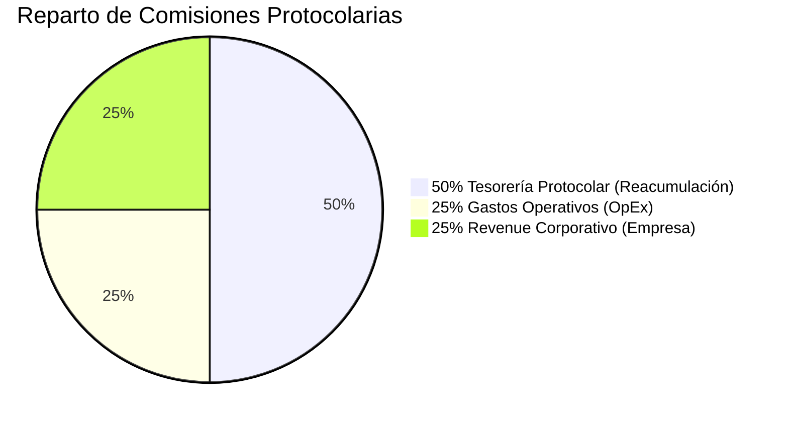

# Alpha Centauri V6 — Tokenómica & Modelo Económico Financiero

**Versión:** 6.0.0-Mainnet  
**Clasificación:** Grado Financiero Auditado  

---

## 1. Distribución Protocolar de Comisiones

El motor financiero de Alpha Centauri V6 opera bajo una regla de reparto estricta e inalterable aplicada a todas las comisiones generadas por transacciones, rendimientos de arbitraje y compras de bonos:



### 1.1. Asignaciones Específicas
- **$50\%$ Tesorería Protocolar**: Se inyecta directamente a la reserva colateral de la Tesorería para incrementar el Net Asset Value ($NAV$) global por cada token ALPHA.
- **$25\%$ Gastos Operativos (OpEx)**: Financia los costos de infraestructura, gas relayer para claims gasless, nodos oráculo Chainlink y mantenimiento de servidores.
- **$25\%$ Revenue Corporativo**: Retorno distribuido a los fundadores y tesorería corporativa de la entidad emisora.

---

## 1.5. Mecanismo de Emisión Anti-Dilución: Dynamic Slippage Fee (NAV Protection)

Para proteger la masa patrimonial del protocolo y evitar arbitrajes por volumen, la emisión de nuevos tokens ALPHA a valor NAV no utiliza una tarifa fija estática. En su lugar, aplica un algoritmo de Slippage Dinámico por Tamaño de Depósito integrado en la ejecución de la EVM.

### 1. Lógica Financiera y Curva de Impacto:
- **Depósitos Minoristas (Bajo Impacto):** Pagan únicamente la comisión base del 0.50%.
- **Depósitos Masivos / Ballenas (Alto Impacto):** La comisión escala automáticamente en función del tamaño del depósito relativo a los Activos Exógenos de Reserva actuales ($A_0$).

### 2. Formulación Matemática (Complejidad $O(1)$):
$$\text{DynamicFeeBps} = \min\left( \text{FeeBase} + \left( \frac{\Delta A}{A_0 + \Delta A} \times \Gamma \right), \text{CapMax} \right)$$

Donde:
- $\text{FeeBase} = 50\text{ bps } (0.50\%)$
- $\Delta A = \text{Monto bruto del depósito en USD}$
- $A_0 = \text{Reserva Exógena Actual (USDC + WBTC + WETH)}$
- $\Gamma = 500\text{ bps } (5.00\% - \text{Coeficiente de Sensibilidad})$
- $\text{CapMax} = 500\text{ bps } (5.00\% - \text{Límite Máximo})$

### 3. Escenarios de Ejecución:
- **Retail:** Depósito $1,000 USD | Reserva $100,000 USD | Impacto 0.99% | Comisión 54 bps (0.54%)
- **Mid-Tier:** Depósito $10,000 USD | Reserva $100,000 USD | Impacto 9.09% | Comisión 95 bps (0.95%)
- **Whale:** Depósito $100,000 USD | Reserva $100,000 USD | Impacto 50.00% | Comisión 300 bps (3.00%)
- **Institutional:** Depósito $500,000 USD | Reserva $100,000 USD | Impacto 83.33% | Comisión 466 bps (4.66%) [Cap 5.00%]

### 4. Accreción Automática de NAV (Flywheel Benefit):
El 100% del sobreprecio recaudado por depósitos de alto impacto se inyecta directamente como Real Yield de Tesorería:
- **50% de la Comisión:** Se canaliza a las Bóvedas Corporativas (OpEx / Profit).
- **50% de la Comisión:** Se distribuye como Real Yield (USDC) a los stakers de ALPHA.

**Efecto Red:** Cada gran entrada de capital incrementa de forma instantánea el valor patrimonial (NAV) de todos los tokens en circulación, garantizando un suelo de rescate ascendente para la comunidad y bloqueando de forma absoluta cualquier ataque MEV o de Sandwich Minting.

---

## 2. Matriz de Asignación de Activos (Asset Allocation Target)

La reserva del protocolo no mantiene un único activo, sino un portafolio equilibrado con rebalanceo automático gestionado por la gobernanza:

| Activo | Símbolo | Tipo de Activo | Peso Objetivo (*Target Weight*) | Función Financiera |
| :--- | :--- | :--- | :--- | :--- |
| **Stablecoins** | `USDC / EURC` | Reserva Líquida | **$50.0\%$** | Cobertura contra volatilidad y liquidez inmediata para rescates NAV. |
| **Wrapped Bitcoin** | `WBTC` | Activo Macro | **$25.0\%$** | Crecimiento patrimonial a largo plazo y apreciación del colateral. |
| **Wrapped Ethereum** | `WETH` | Liquid Staking | **$12.5\%$** | Generación de staking yield pasivo sobre Ethereum. |
| **ALPHA Staking** | `ALPHA` | Gobernanza Native | **$12.5\%$** | Bloqueo nativo en pool de gobernanza para sostener la demanda del token. |

### 2.1. Invariante de Rebalanceo
$$\sum_{i=1}^{4} Weight_i = 5000_{bps} + 2500_{bps} + 1250_{bps} + 1250_{bps} = 10,000_{bps} \quad (100.0\%)$$

---

## 3. Curva de Descuento de Bonos Vestados (*Vested Bonds*)

Los usuarios pueden adquirir bonos vestados depositando USDC en `VestedDiscountVault.sol`. A cambio de bloquear su liquidez por un período determinado, reciben un descuento sobre el valor NAV del token ALPHA:

```mermaid
gantt
    title Períodos de Vesting y Descuentos Dinámicos
    dateFormat  X
    axisFormat %s
    section Bono a 3 Años
    Bloqueo de Principal (15% Descuento) : active, 0, 3
    Desbloqueo de Principal 100% : milestone, 3, 3
    section Bono a 5 Años
    Bloqueo de Principal (20% Descuento) : active, 0, 5
    Desbloqueo de Principal 100% : milestone, 5, 5
```



### 3.1. Fórmulas de Adquisición
- **Bono 3 Años ($15\%$ Descuento)**:
  $$Tokens_{Minted} = \frac{Principal_{USDC}}{NAV \times (1 - 0.15)} = \frac{Principal_{USDC}}{NAV \times 0.85}$$
- **Bono 5 Años ($20\%$ Descuento)**:
  $$Tokens_{Minted} = \frac{Principal_{USDC}}{NAV \times (1 - 0.20)} = \frac{Principal_{USDC}}{NAV \times 0.80}$$

---

## 4. Mecanismo de Desintegración Anticipada (*Ragequit*)

Si un titular de un NFT de Posición de Bono necesita liquidez inmediata antes del vencimiento del bloqueo, el protocolo le permite ejecutar un **Ragequit** en `VestedDiscountVault.sol`.

### 4.1. Penalización Fija del 30%
Al ejecutar el Ragequit, el sistema aplica una penalización incondicional del **$30\%$ sobre el capital nominal depositado**:

$$\text{Retorno Usuario} = Principal \times 70\%$$

$$\text{Monto Penalización} = Principal \times 30\%$$

### 4.2. Distribución de la Penalización del 30%
La penalización cobrada se divide automáticamente en tres fracciones equitativas:

```mermaid
graph LR
    Penalty[30% Penalización Ragequit] -->|50% (15% del total)| Treasury[Tesorería Protocolar]
    Penalty -->|25% (7.5% del total)| Stakers[Governance Staking Pool]
    Penalty -->|25% (7.5% del total)| Burn[Burn Address (Deflación)]
```

1. **$50\%$ de la Penalización ($15\%$ del Principal)**: Inyectado a la Tesorería para incrementar el NAV de todos los holders restantes.
2. **$25\%$ de la Penalización ($7.5\%$ del Principal)**: Transferido a `GovernanceStaking.sol` como dividendo instantáneo para los stakers de ALPHA.
3. **$25\%$ de la Penalización ($7.5\%$ del Principal)**: Enviado a la dirección de quemado (`0x0000...dead`) reduciendo el suministro circulante de ALPHA.
