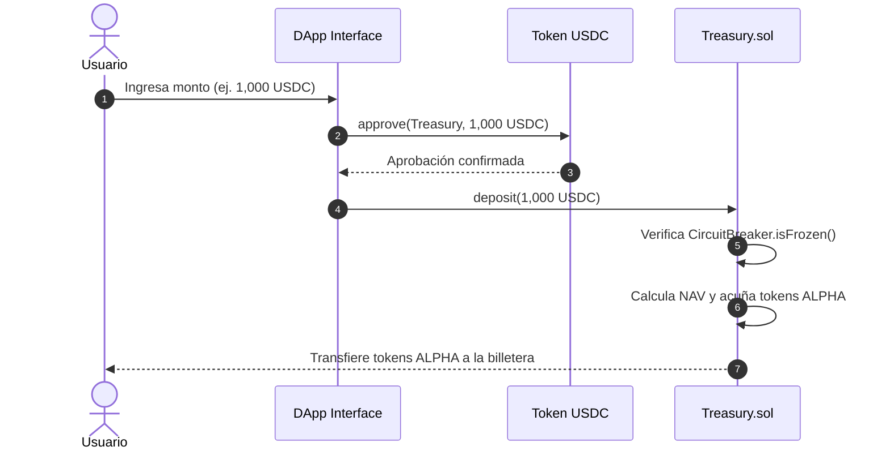
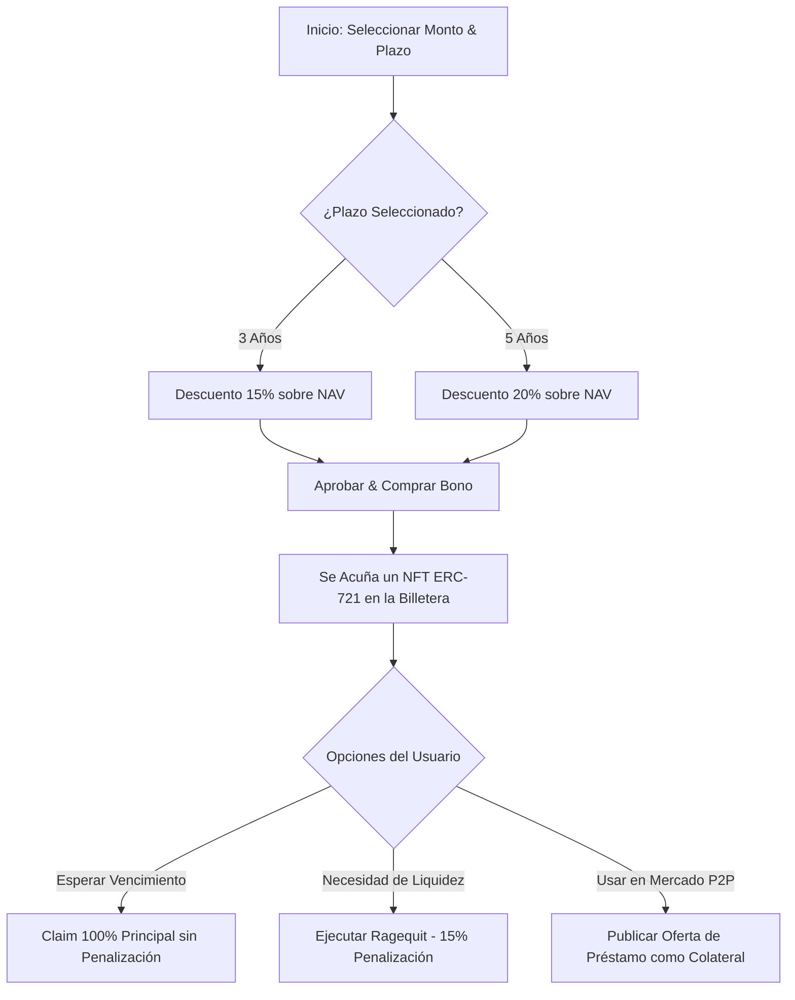
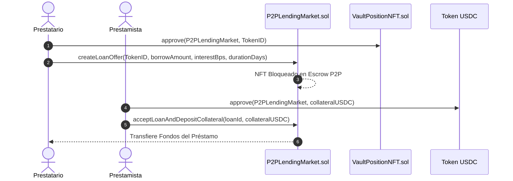

# Alpha Centauri V6 — Guías de Usuario & Tutoriales Detallados

**Versión:** 6.0.0-Mainnet  
**Audiencia:** Usuarios Retail, Liquidity Providers, Operadores Institucionales  

---

## 🚀 0. Inicio Rápido: Lanzamiento de la Aplicación

Para desplegar y ejecutar todo el ecosistema (nodo Anvil, Smart Contracts, Frontend Web3 y pre-fondeo de 10,000 USDC) con un solo comando desde la raíz del proyecto:

- **Vía PowerShell**: `.\start_app.ps1`
- **Vía NPM**: `npm start`
- **Vía Windows Batch**: Doble clic sobre `start_app.bat`

Una vez iniciado, accede a la interfaz gráfica en **[http://localhost:5173](http://localhost:5173)**.

---

## 1. Guía del Inversor: Depósito y Rescate en Tesorería

### Paso a Paso: Depósito de USDC
1. **Conectar Billetera**: En la barra superior, asegúrate de estar conectado a la red Anvil / EVM objetivo.
2. **Navegar a la Pestaña "Panel Cliente"**: Selecciona el módulo **Tesorería & Proof of Reserves**.
3. **Ingresar Monto**: Escribe la cantidad de USDC que deseas depositar (ej. `1000`).
4. **Hacer Clic en "Depositar USDC"**:
   - La interfaz solicitará primero la aprobación de USDC (`approve`).
   - Posteriormente enviará la transacción de depósito (`deposit`).
5. **Confirmación**: Verás un mensaje Toast flotante notificando la acuñación exitosa de tus participaciones ALPHA a valor NAV.

---

## 2. Guía de Bonos Vestados: Compra y Gestión de Posiciones NFT

### Paso a Paso: Adquisición de Bonos
1. Dirígete a la sección **Bonos Vestados con NFT**.
2. Ingresa el **Principal en USDC** (ej. `$1,000`).
3. Selecciona el **Período de Bloqueo** (`3 Años` o `5 Años`).
4. (Opcional) Introduce la dirección de tu referido.
5. Haz clic en **"Comprar Bono Vestado"**. Una vez confirmada la transacción, se generará una tarjeta con tu **NFT de Posición #ID** en tu galería personal.

---

## 3. Guía del Mercado P2P: Préstamos Colateralizados

### 3.1. Publicar Oferta de Préstamo (Prestatario)
1. Selecciona el **ID de tu NFT de Posición** disponible.
2. Define el **Monto a Solicitar** (ej. `$500 USDC`).
3. Ajusta el **Interés (BPS)** (ej. `1000 bps = 10%`) y la **Duración en Días** (ej. `30`).
4. Haz clic en **"Crear Oferta de Préstamo"**. Tu NFT quedará resguardado como colateral on-chain.

### 3.2. Liquidación Automática por Impago
Si la fecha de vencimiento transcurre sin que el prestatario ejecute `repayLoan()`, el prestamista puede hacer clic en **"Ejecutar Auto-Liquidación"** para transferir la propiedad del NFT colateral directamente a su billetera.

---

## 4. Guía de Gobernanza: Staking de ALPHA y Enrutador Real Yield

1. En la pestaña **Gobernanza & Staking**, ingresa la cantidad de tokens ALPHA a bloquear.
2. Haz clic en **"Stake ALPHA"**.
3. **Seleccionar Preferencia de Cobro**:
   - **Opción A (USDC)**: Dividendos convertidos automáticamente a stablecoins.
   - **Opción B (WBTC/WETH)**: Dividendos pagados en activos de reserva.
4. **Reclamo Gasless**: Haz clic en **"Reclamar Yield (Gasless)"** para ejecutar la meta-transacción patrocinada por la infraestructura relayer.
