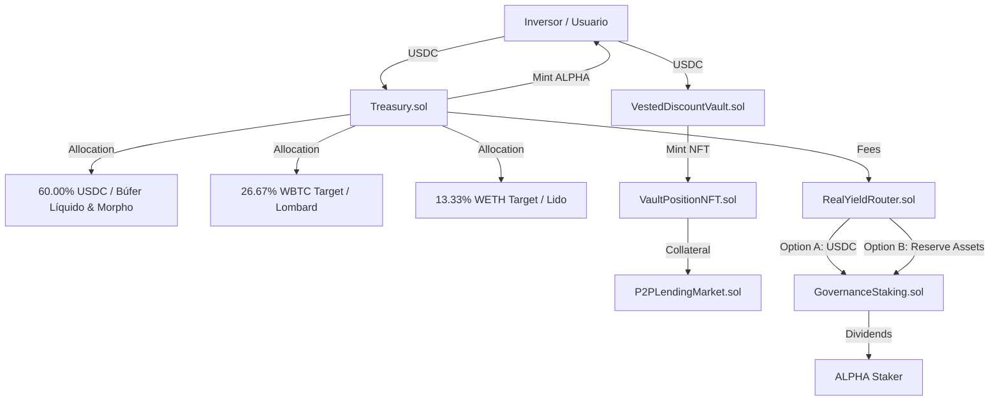

# Alpha Centauri V6 — Whitepaper & Arquitectura Técnica del Protocolo

**Versión:** 6.0.0-Mainnet  
**Estado:** Mainnet-Ready  
**Fecha:** Julio 2026  
**Clasificación:** Institucional / Grado Financiero Auditado  

---

## 1. Resumen Ejecutivo

**Alpha Centauri V6** es un protocolo descentralizado de reserva de valor y rendimiento real (*Real Yield*) construido sobre Ethereum y redes EVM equivalentes. El sistema combina una Tesorería colateralizada dinámicamente con Proof of Reserves (PoR) en tiempo real, un mercado de bonos vestados con NFTs de posición (ERC-721), un mercado de préstamos peer-to-peer (P2P) auto-liquidable, y un enrutador inteligente de dividendos respaldado por activos de reserva.

El protocolo está diseñado para garantizar **solvencia matemáticamente demostrable**, resistencia a manipulación de oráculos mediante un búffer circular de volatilidad (`CircuitBreaker`), y protección contra ataques relámpago a la gobernanza mediante un módulo `TimelockController` con retardo de 48 horas.



---

## 2. Visión y Problema que Resuelve

### 2.1. Problemas de los Modelos DeFi Tradicionales
1. **Rendimiento Ilusorio (Farm & Dump)**: La mayoría de protocolos emiten tokens inflacionarios sin respaldo de ingresos reales para sostener APYs insostenibles.
2. **Opacidad de Reservas**: Falta de transparencia on-chain sobre el estado de solvencia y la calidad de colateral en tiempo real.
3. **Vulnerabilidad a Oráculos y Flash Loans**: Ataques de manipulación de precio en oráculos sintéticos que liquidan bóvedas de forma prematura.
4. **Falta de Liquidez en Períodos de Bloqueo**: Imposibilidad de monetizar posiciones en bonos bloqueados a largo plazo.

### 2.2. Solución Alpha Centauri V6
- **Reserva Exógena Pura Respaldada por Activos**: Cada token ALPHA acuñado está respaldado $100\%$ por una cesta ponderada de activos exógenos de alta liquidez (60.00% USDC, 26.67% WBTC, 13.33% WETH).
- **Proof of Reserves (PoR) Continuo**: Verificación on-chain de solvencia instantánea con ratio de colateralización $\ge 100\%$.
- **NFTs de Posición Dinámicos**: Los bonos vestados a 3 o 5 años se representan como NFTs ERC-721 transferibles y utilizables como colateral de préstamos P2P.
- **Rendimiento Real (Real Yield)**: Distribución de dividendos generados por comisiones de protocolo en USDC o activos de reserva elegidos por el usuario.

---

## 3. Arquitectura del Sistema

El sistema se compone de **9 contratos inteligentes modulares** organizados en capas funcionales:

```
┌────────────────────────────────────────────────────────────────────────┐
│                        CAPA DE INTERFAZ & DAPP                         │
└──────────────────────────────────┬─────────────────────────────────────┘
                                   │
┌──────────────────────────────────▼─────────────────────────────────────┐
│                      CAPA DE ACCESO Y ACCIÓN                           │
│  ┌───────────────────────┐   ┌──────────────────────────────────────┐  │
│  │  TreasuryProxy.sol    │   │      RealYieldRouter.sol            │  │
│  └───────────┬───────────┘   └──────────────────┬───────────────────┘  │
└──────────────┼──────────────────────────────────┼──────────────────────┘
               │                                  │
┌──────────────▼──────────────────────────────────▼──────────────────────┐
│                    CAPA DE LÓGICA DE NEGOCIO CORE                      │
│  ┌───────────────────────┐   ┌──────────────────────────────────────┐  │
│  │     Treasury.sol      │   │       GovernanceStaking.sol          │  │
│  └───────────┬───────────┘   └──────────────────┬───────────────────┘  │
│  ┌───────────▼───────────┐   ┌──────────────────▼───────────────────┐  │
│  │ VestedDiscountVault.sol│   │        P2PLendingMarket.sol          │  │
│  └───────────┬───────────┘   └──────────────────┬───────────────────┘  │
│  ┌───────────▼───────────┐   ┌──────────────────▼───────────────────┐  │
│  │ VaultPositionNFT.sol  │   │     CorporateContribution.sol      │  │
│  └───────────────────────┘   └──────────────────────────────────────┘  │
└──────────────────────────────────┬─────────────────────────────────────┘
                                   │
┌──────────────────────────────────▼─────────────────────────────────────┐
│                   CAPA DE SEGUIRIDAD Y GOBERNANZA                      │
│  ┌───────────────────────┐   ┌──────────────────────────────────────┐  │
│  │   CircuitBreaker.sol  │   │       TimelockController.sol         │  │
│  └───────────────────────┘   └──────────────────────────────────────┘  │
└────────────────────────────────────────────────────────────────────────┘
```

---

## 4. Mitigación de Riesgos y Seguridad

### 4.1. CircuitBreaker (Detección de Volatilidad)
El contrato `CircuitBreaker.sol` mantiene un **búffer circular de los últimos 10 precios reportados** por el oráculo. Cuando una transacción de depósito o compra de bono intenta ejecutarse:
1. El contrato calcula la desviación porcentual respecto a la media móvil.
2. Si la desviación supera el umbral configurado (ej. 10%), el activo se congela automáticamente (`isFrozen(asset) == true`).
3. Operaciones de alto riesgo se congelan de inmediato hasta que la gobernanza reevalúe y ejecute `resetBreaker()`.

### 4.2. TimelockController (Gobernanza con Retardo de 48h)
Todas las operaciones críticas (modificación de oráculos, rebalanceo de pesos, actualización de comisiones) deben proponerse y pasar un periodo de espera (*minDelay*) de **48 horas**. Esto otorga a la comunidad e inversores tiempo suficiente para auditar cambios o retirar fondos antes de su efectividad.

### 4.3. Propiedades e Invariantes Formales
El protocolo garantiza de forma estricta los siguientes invariantes:

$$\text{Invariante 1: Solvencia PoR} \quad \Rightarrow \quad \text{Total Assets (USD)} \ge \text{Total Liabilities (USD)}$$

$$\text{Invariante 2: Ratio de Colateral} \quad \Rightarrow \quad Ratio_{bps} = \frac{\sum (Balance_i \times Price_i)}{Supply_{ALPHA} \times NAV} \times 10,000 \ge 10,000$$

$$\text{Invariante 3: Penalización Ragequit} \quad \Rightarrow \quad Penalty = Principal \times 30\% = (Treasury_{15\%} + Stakers_{7.5\%} + Burn_{7.5\%})$$

---

## 5. Cumplimiento de Estándares EIP/ERC

- **ERC-20**: Implementado en `Treasury.sol` para el token de participaciones ALPHA.
- **ERC-721**: Implementado en `VaultPositionNFT.sol` para la representación colateralizable de bonos vestados.
- **ERC-165**: Soporte de introspección de interfaces en NFTs y Vaults.
- **EIP-712**: Estructura de firmas para soporte de meta-transacciones y reclamos gasless.
- **EIP-2098**: Compact Short Signatures en firmas criptográficas.
