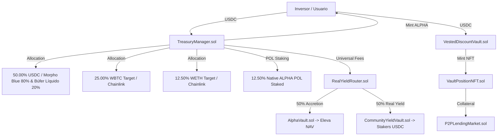

# Alpha Centauri V6 — Whitepaper & Arquitectura Técnica del Protocolo

**Versión:** 6.5.0-Mainnet  
**Estado:** Mainnet-Ready & Audited  
**Fecha:** Agosto 2026  
**Clasificación:** Infraestructura Descentralizada Institucional (Pure DeFi)  

---

## 1. Resumen Ejecutivo

**Alpha Centauri** es un protocolo financiero descentralizado (*Pure DeFi*) de grado institucional diseñado para la emisión, custodia y comercialización de un activo sintético de reserva respaldado por colateral exógeno ($ALPHA$). El sistema combina una Tesorería colateralizada dinámicamente con Proof of Reserves (PoR) en tiempo real, un mercado de bonos vestados representados como NFTs de posición (ERC-721), un mercado de préstamos peer-to-peer (P2P) auto-liquidable, y un enrutador universal de dividendos reales en USDC respaldado por la actividad económica on-chain.

El protocolo está diseñado bajo cuatro principios no negociables:
1. **Solvencia Matemáticamente Demostrable ($PoR \ge 100\%$):** Respaldo íntegro de pasivos con colaterales exógenos (USDC, WBTC, WETH).
2. **Monotonicidad del NAV Spot ($\Delta NAV \ge 0$):** El valor liquidativo por share nunca puede degradarse por operaciones internas.
3. **Descentralización Plena (Exención MiCA Considerando 22):** Inexistencia de intermediarios fiduciarios, comisiones corporativas o llaves privadas individuales.
4. **Resiliencia Operativa y Defensa Anti-MEV:** Búfer de volatilidad (`CircuitBreaker.sol`), oráculos duales con detección de secuenciador L2 (`OracleHub.sol`) y cooldown same-block.

---

## 2. Visión y Problema que Resuelve

### 2.1. Problemas de los Modelos DeFi Tradicionales
1. **Rendimiento Ilusorio (Farm & Dump):** Protocolos que emiten tokens inflacionarios sin respaldo de ingresos reales para sostener APYs ficticios.
2. **Colateralización Circular:** Proyectos que cuentan su propio token nativo como colateral para respaldar su propia emisión (modelo Terra/LUNA o FTX/FTT), provocando espirales de muerte al caer el mercado.
3. **Opacidad de Reservas:** Falta de auditoría criptográfica on-chain en tiempo real sobre el balance de activos y pasivos.
4. **Vulnerabilidad a Oráculos y Flash Loans:** Manipulación de precios en un único bloque para drenar fondos mediante préstamos relámpago.

### 2.2. Solución Alpha Centauri V6
- **Respaldo Exógeno Puro:** El valor de ALPHA está respaldado exclusivamente por activos exógenos reales (USDC, WBTC, WETH). Los tokens ALPHA en manos del protocolo son deducidos del suministro circulante, aumentando el NAV de los inversores.
- **Proof of Reserves (PoR) Continuo:** Cálculo on-chain en cada bloque del ratio de solvencia ($TotalAssetsUSD / TotalLiabilitiesUSD \ge 100\%$).
- **Rendimiento Real (Real Yield 50/50):** 50% de comisiones inyectadas a reservas para elevar el NAV Spot de todos los tenedores, y 50% distribuidas como dividendos líquidos en USDC a los stakers comunitarios (`CommunityYieldVault.sol`).
- **Bonos Vestados y Mercado P2P:** Bonos con descuentos dinámicos (5% a 25%) encapsulados en NFTs ERC-721 transferibles y utilizables como garantía para obtener liquidez P2P sin vender la posición.

---

## 3. Arquitectura del Sistema y Contratos Modulares

El sistema opera mediante **25 smart contracts fuertemente desacoplados** organizados en capas funcionales mediante el Service Locator [`ProtocolAddressProvider.sol`](file:///c:/Users/Admin/Desktop/token/contracts/src/ProtocolAddressProvider.sol):

1. **Núcleo de Emisión y Tesorería:**
   - [`TreasuryManager.sol`](file:///c:/Users/Admin/Desktop/token/contracts/src/TreasuryManager.sol): Motor de emisión a NAV, rescates y verificación de solvencia (100% Permissionless Pure DeFi).
   - [`CompliantTreasuryGateway.sol`](file:///c:/Users/Admin/Desktop/token/contracts/src/adapters/CompliantTreasuryGateway.sol): Pasarela institucional stateless para contrapartes reguladas (KYC/AML delegado).
   - [`DiscountBuybackEngine.sol`](file:///c:/Users/Admin/Desktop/token/contracts/src/DiscountBuybackEngine.sol): Motor autónomo de estabilización algorítmica y quema deflacionaria (10 Candados de Control).
   - [`AlphaVault.sol`](file:///c:/Users/Admin/Desktop/token/contracts/src/AlphaVault.sol): Búnker frío de custodia de activos de reserva exógenos.
   - [`AlphaToken.sol`](file:///c:/Users/Admin/Desktop/token/contracts/src/AlphaToken.sol): Token sintético ERC-20 ALPHA.
   - [`ProtocolTokenomicsEngine.sol`](file:///c:/Users/Admin/Desktop/token/contracts/src/ProtocolTokenomicsEngine.sol): Motor de cálculo matemático purificado sin estado mutable.

2. **Capa de Oráculos y Seguridad L2:**
   - [`OracleHub.sol`](file:///c:/Users/Admin/Desktop/token/contracts/src/OracleHub.sol): Oráculo primario Chainlink con conmutación a Pyth Network y detección de Grace Period de Secuenciador L2.
   - [`CircuitBreaker.sol`](file:///c:/Users/Admin/Desktop/token/contracts/src/CircuitBreaker.sol): Interruptor de congelamiento ante caídas abruptas (>15% en 6h).
   - [`DynamicYieldOracleRouter.sol`](file:///c:/Users/Admin/Desktop/token/contracts/src/DynamicYieldOracleRouter.sol): Consulta de APYs institucionales de mercado.

3. **Flujo Real Yield y Gobernanza:**
   - [`RealYieldRouter.sol`](file:///c:/Users/Admin/Desktop/token/contracts/src/RealYieldRouter.sol): Enrutador universal de comisiones (50% Reservas / 50% Comunidad).
   - [`CommunityYieldVault.sol`](file:///c:/Users/Admin/Desktop/token/contracts/src/CommunityYieldVault.sol): Distribución de dividendos en USDC a stakers.
   - [`GovernanceStaking.sol`](file:///c:/Users/Admin/Desktop/token/contracts/src/GovernanceStaking.sol): Staking líquido ($stALPHA$) con checkpoints de votación DAO.
   - [`GovernorAlphaCentauri.sol`](file:///c:/Users/Admin/Desktop/token/contracts/src/GovernorAlphaCentauri.sol) & [`TimelockController.sol`](file:///c:/Users/Admin/Desktop/token/contracts/src/TimelockController.sol): Gobernanza con retardo de 72 horas.

4. **Mercados Monetarios y Productos Estructurados:**
   - [`VestedDiscountVault.sol`](file:///c:/Users/Admin/Desktop/token/contracts/src/VestedDiscountVault.sol): Emisión de bonos a 1-5 años con opción de *ragequit*.
   - [`VaultPositionNFT.sol`](file:///c:/Users/Admin/Desktop/token/contracts/src/VaultPositionNFT.sol): NFTs representativos de las posiciones de bonos (almacenamiento compacto).
   - [`P2PLendingMarket.sol`](file:///c:/Users/Admin/Desktop/token/contracts/src/P2PLendingMarket.sol): Mercado monetario P2P con defensa asimétrica en L2 Grace Period.
   - [`MorphoYieldVaultAdapter.sol`](file:///c:/Users/Admin/Desktop/token/contracts/src/MorphoYieldVaultAdapter.sol): Adaptador ERC-4626 para generación de rendimiento pasivo.

---

## 4. Mitigación de Riesgos y Seguridad

### 4.1. CircuitBreaker (Detección de Volatilidad)
Mantiene un búffer circular de precios reportados por los oráculos para suspender compras de activos en caso de anomalías extremas de mercado.

### 4.2. TimelockController (Gobernanza con Retardo de 72h)
Todas las operaciones críticas (actualización de contratos, parámetros de riesgo o modificación de oráculos) exigen un período de espera obligatorio de **72 horas**, garantizando que los usuarios puedan auditar los cambios con antelación.

### 4.3. Anti-MEV Same-Block Cooldown
Neutraliza ataques atómicos de arbitraje mediante la restricción `lastDepositBlock[msg.sender] < block.number`.

### 4.4. Resiliencia L2 (Defensa Asimétrica en Sequencer Grace Period)
Protege a los prestatarios ante fallos del secuenciador L2, permitiendo amortizaciones de deuda (`repayLoan`) mientras bloquea liquidaciones injustas (`liquidateLoan`) hasta que los oráculos confirmen su frescura.

---

## 5. Marco Regulatorio de la Unión Europea (MiCA - Reglamento UE 2023/1114)

### 5.1. Exención de Descentralización Plena (Considerando 22)
El Considerando 22 del Reglamento (UE) 2023/1114 establece que los servicios de criptoactivos prestados de manera **totalmente descentralizada y sin intermediarios** quedan fuera del perímetro de aplicación de MiCA.

Alpha Centauri se adhiere a este principio mediante:
* **Core Descentralizado y Sin Permisos:** Las funciones de depósito y rescate en `TreasuryManager.sol` son 100% públicas y libres de permisos o listas blancas centralizadas.
* **Aislamiento de la Pasarela de Cumplimiento:** Los procesos de verificación KYC para contrapartes reguladas se segregan en el adaptador *stateless* `CompliantTreasuryGateway.sol`, eliminando la condición de proveedor de servicios (CASP) del protocolo base.
* **Cero Llaves Privadas Corporativas:** La administración recae exclusivamente en la DAO y el Timelock de 72 horas.
* **Sin Comisiones de Gestión Centralizadas:** El 100% de los ingresos se distribuye algorítmicamente mediante contratos inmutables (50% Reservas / 50% Comunidad).
* **No Custodia:** Los usuarios interactúan directamente con los contratos mediante sus propias billeteras no custodiales (*unhosted wallets*).

### 5.2. No Calificación como ART o EMT
El token $ALPHA$ no constituye un *Asset-Referenced Token* (ART) ni un *E-Money Token* (EMT) comercializado por un emisor centralizado, sino una unidad contable representativa de una cuota de participación en una tesorería algorítmica on-chain gobernada por smart contracts.

---

## 6. Declaración de Riesgos y No Promisión de Rentabilidad

1. **Fluctuación del NAV:** El Valor Patrimonial Neto ($NAV$) por share depende de la valoración de mercado de la cesta de colaterales exógenos (USDC, WBTC, WETH). Ninguna métrica mostrada en la interfaz constituye una garantía de rentabilidad futura ni un depósito a plazo garantizado.
2. **Naturaleza Desintermediada del Mercado P2P:** Los préstamos originados en `P2PLendingMarket.sol` representan acuerdos bilaterales directos entre prestatarios y prestamistas ejecutados mediante contratos inteligentes sin garantía de crédito por parte del protocolo.
3. **Riesgo Tecnológico y de Smart Contracts:** Toda interacción con protocolos descentralizados conlleva riesgos de fallo de red, volatilidad de gas o imprevistos técnicos en la capa de ejecución blockchain.

---

## 7. Despliegue Descentralizado y Verificabilidad Criptográfica

Para blindar la soberanía del acceso de los usuarios y evitar puntos únicos de censura:
* **Alojamiento en Redes Descentralizadas (IPFS / Arweave):** El frontend está compilado con rutas relativas (`base: './'`) para su distribución inmutable en IPFS.
* **Resolución vía ENS:** Vinculación directa del CIDv1 de IPFS al dominio `alphacentauri.eth` mediante el registro `contenthash`.
* **Manifiesto de Integridad SHA-256:** Cada versión compilada genera un archivo `ipfs-manifest.json` con las sumas de verificación de cada recurso web para auditoría pública independiente.
